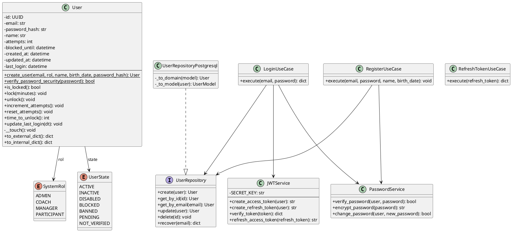
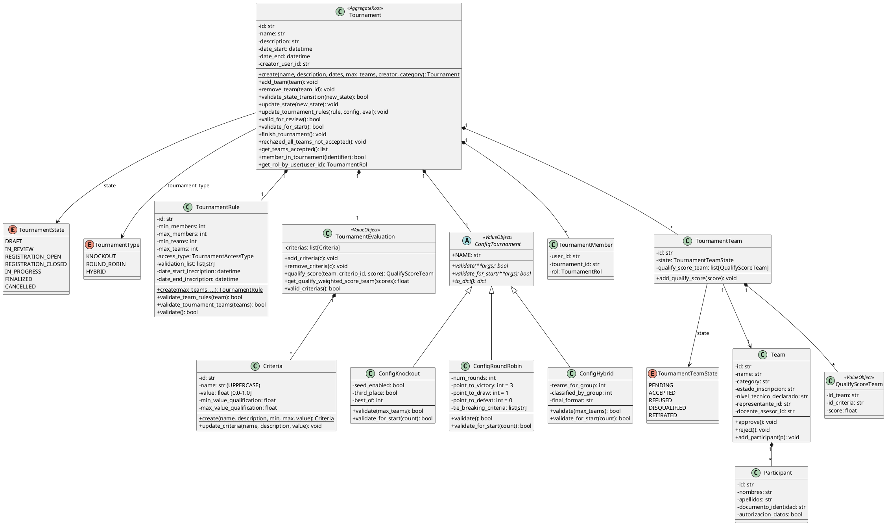
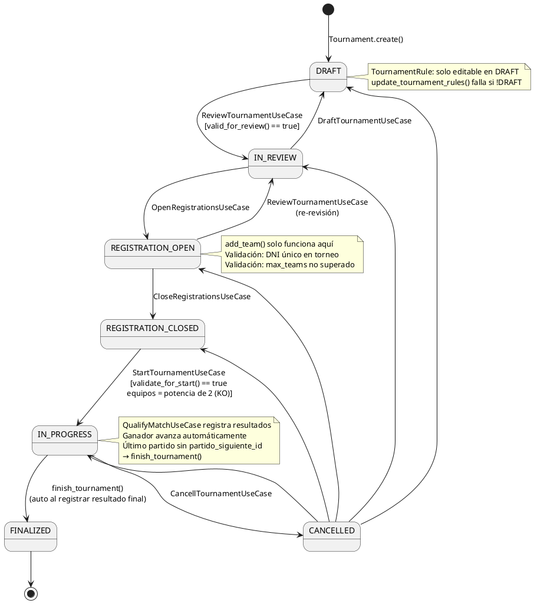
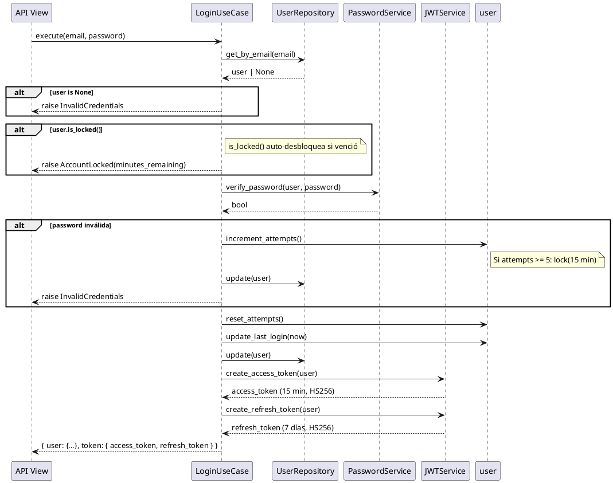
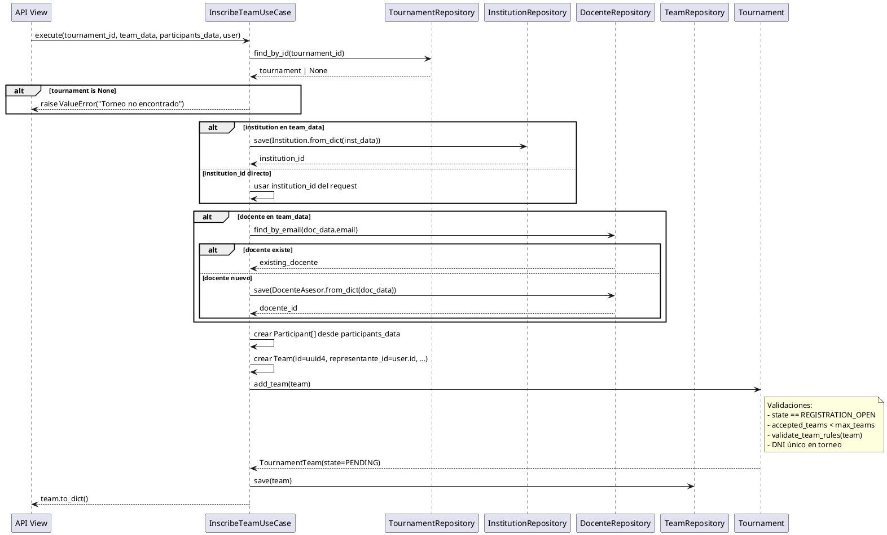
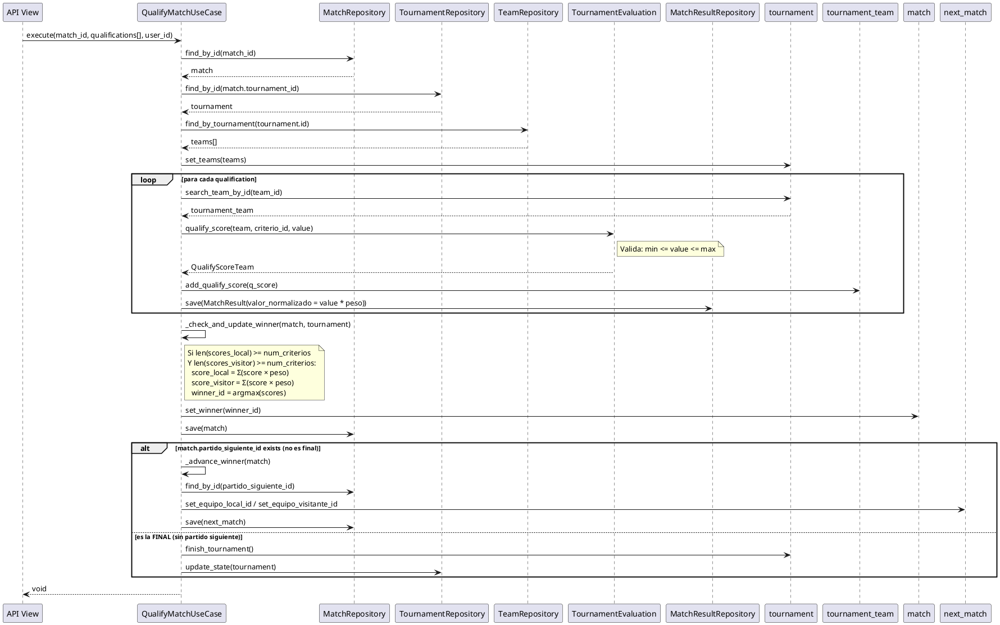
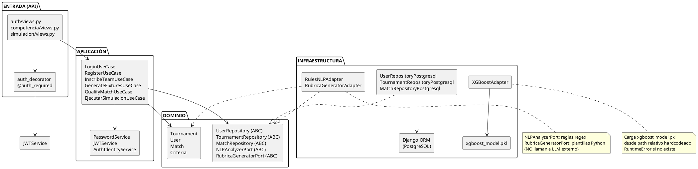
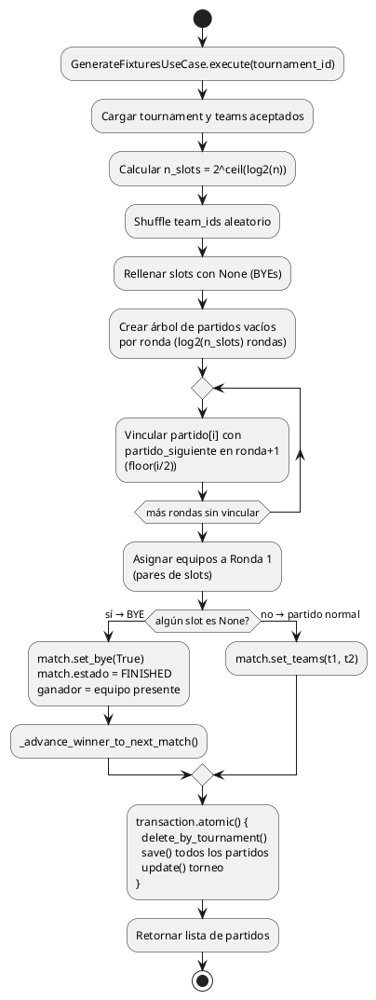

# Análisis Domain-Driven Design — Zoids League
**Auditor:** Experto en DDD (Claude Sonnet 4.6)  
**Fecha:** 2026-06-19  
**Metodología:** Análisis estático del código fuente + trazabilidad de dependencias

---

## Índice

1. [Contextos Delimitados](#1-contextos-delimitados-bounded-contexts)
2. [Entidades](#2-entidades)
3. [Value Objects](#3-value-objects)
4. [Servicios de Dominio](#4-servicios-de-dominio)
5. [Reglas de Negocio](#5-reglas-de-negocio)
6. [Agregados](#6-agregados)
7. [Repositorios](#7-repositorios-puertos)
8. [Casos de Uso](#8-casos-de-uso)
9. [Diagramas UML](#9-diagramas-uml)
10. [Hallazgos DDD](#10-hallazgos-y-violaciones-ddd)

---

## 1. Contextos Delimitados (Bounded Contexts)

El sistema presenta **4 contextos delimitados** identificables:

```
┌─────────────────────────────────────────────────────────────────┐
│                        ZOIDS LEAGUE                             │
│                                                                 │
│  ┌────────────────┐    ┌─────────────────┐    ┌─────────────┐  │
│  │  AUTHENTICATION │    │   COMPETENCIA   │    │  SIMULACION │  │
│  │                │    │                 │    │             │  │
│  │  · User        │◄───│  · Tournament   │◄───│  · Pred.    │  │
│  │  · SystemRol   │    │  · Team         │    │  · Análisis │  │
│  │  · UserState   │    │  · Match        │    │  · Retos    │  │
│  │  · JWT         │    │  · Standing     │    │             │  │
│  └────────────────┘    │  · Criteria     │    └─────────────┘  │
│                        │  · Institution  │                      │
│  ┌────────────────┐    └─────────────────┘                      │
│  │   ANALÍTICA    │             ▲                               │
│  │  (Placeholder) │─────────────┘                               │
│  └────────────────┘                                             │
└─────────────────────────────────────────────────────────────────┘
```

| Contexto | Responsabilidad | Estado |
|---|---|---|
| **Authentication** | Identidad, autenticación JWT, roles | Completo |
| **Competencia** | Torneos, equipos, partidos, criterios, IA | Completo |
| **Simulacion** | Predicción ML, análisis de entregables | Completo |
| **Analítica** | Reportes y estadísticas | Placeholder |

**Nota de acoplamiento:** `competencia` importa directamente `authentication.domain.value_objects` (`SystemRol`, `UserState`). Esto viola el aislamiento entre contextos — un contexto compartido (Shared Kernel) no está definido explícitamente.

---

## 2. Entidades

### 2.1 Contexto Authentication

#### `User` — Entidad Raíz

```
authentication/domain/entities/user.py
```

| Atributo | Tipo | Descripción |
|---|---|---|
| `id` | `uuid.UUID` | Identidad global única |
| `email` | `str` | Email validado (contiene @, .) |
| `password_hash` | `str \| None` | Hash bcrypt |
| `name` | `str` | Nombre no vacío |
| `rol` | `SystemRol` | admin / coach / manager / participant |
| `state` | `UserState` | Estado del ciclo de vida |
| `birth_date` | `datetime` | Fecha nacimiento (edad 3–80 años) |
| `attempts` | `int` | Intentos fallidos de login |
| `blocked_until` | `datetime \| None` | Momento de desbloqueo |
| `created_at` | `datetime` | Creación (América/Lima) |
| `updated_at` | `datetime` | Última modificación (auto-touch) |
| `last_login` | `datetime \| None` | Último acceso |

**Constantes de dominio:**

| Constante | Valor | Significado |
|---|---|---|
| `__MAX_ATTEMPTS` | 5 | Intentos antes de bloqueo |
| `__MIN_LOCK_TIME` | 15 | Minutos de bloqueo mínimo |
| `__MIN_PASSWORD_LENGTH` | 8 | Longitud mínima de contraseña |
| `__MIN_AGE` | 3 | Edad mínima permitida |
| `__MAX_AGE` | 80 | Edad máxima permitida |

**Comportamientos de dominio:**

| Método | Descripción |
|---|---|
| `create_user()` | Factory: crea usuario con estado NOT_VERIFIED |
| `verify_password_security()` | Estático: longitud ≥ 8, dígito, mayúscula, minúscula |
| `is_locked()` | Verifica si está bloqueado (auto-desbloqueo si venció) |
| `lock(minutes)` | Bloquea N minutos, resetea intentos, pone BLOCKED |
| `unlock()` | Desbloquea, resetea intentos, pone ACTIVE |
| `increment_attempts()` | +1 intento; auto-bloquea si ≥ `MAX_ATTEMPTS` |
| `reset_attempts()` | Resetea a 0, pone ACTIVE |
| `time_to_unlock()` | Minutos restantes de bloqueo |
| `update_last_login()` | Registra timestamp |
| `__touch()` | Actualiza `updated_at` (invocado por setters) |

---

### 2.2 Contexto Competencia

#### `Tournament` — Aggregate Root

```
competencia/domain/entities/tournament.py
```

| Atributo | Tipo | Descripción |
|---|---|---|
| `id` | `str` | UUID string |
| `name` | `str` | Nombre del torneo |
| `description` | `str` | Descripción |
| `date_start` | `datetime` | Inicio (naive, > now) |
| `date_end` | `datetime` | Fin (naive, > date_start) |
| `creator_user_id` | `str` | Creador |
| `state` | `TournamentState` | Estado actual (máquina de estados) |
| `category` | `TournamentCategory` | Categoría educativa |
| `tournament_type` | `TournamentType` | Formato (KO/RR/Hybrid) |
| `tournament_rule` | `TournamentRule` | Reglas operativas |
| `config_tournament` | `ConfigTournament` | Configuración de formato |
| `tournament_evaluation` | `TournamentEvaluation` | Criterios de evaluación |
| `users_tournaments` | `list[TournamentMember]` | Usuarios y roles (mín. 1) |
| `tournament_teams` | `list[TournamentTeam]` | Equipos inscritos |

#### `Team`

```
competencia/domain/entities/team.py
```

| Atributo | Tipo | Descripción |
|---|---|---|
| `id` | `str` | UUID string |
| `tournament_id` | `str` | FK al torneo |
| `name` | `str` | Nombre del equipo |
| `category` | `str` | PRIMARY \| SECONDARY |
| `institution_id` | `str` | FK a institución |
| `nivel_tecnico_declarado` | `str` | Nivel técnico |
| `estado_inscripcion` | `str` | PENDIENTE/APROBADO/RECHAZADO |
| `fecha_inscripcion` | `datetime` | Fecha de inscripción (naive) |
| `representante_id` | `str` | Usuario representante |
| `docente_asesor_id` | `str` | Docente asesor |
| `participants` | `list[Participant]` | Participantes |

#### `Participant`

```
competencia/domain/entities/participant.py
```

| Atributo | Tipo | Descripción |
|---|---|---|
| `id` | `str` | UUID |
| `nombres` | `str` | Nombres |
| `apellidos` | `str` | Apellidos |
| `documento_identidad` | `str` | DNI — identidad del participante |
| `edad` | `int` | Edad |
| `grado_academico` | `str` | Grado académico |
| `rol_en_equipo` | `str` | Rol dentro del equipo |
| `email` | `str` | Email opcional |
| `birth_date` | `date` | Fecha nacimiento |
| `autorizacion_datos` | `bool` | Consentimiento obligatorio |

**Invariante:** `autorizacion_datos` == `False` → `ValueError` en construcción. Igualdad y hash por `documento_identidad`.

#### `TournamentTeam`

```
competencia/domain/entities/tournament_team.py
```

Relación muchos-a-muchos entre Tournament y Team con estado propio.

| Atributo | Tipo |
|---|---|
| `id` | `str` |
| `tournament_id` | `str` |
| `team` | `Team` |
| `state` | `TournamentTeamState` |
| `member_in_tournament_func` | `callable` |
| `qualify_score_team` | `list[QualifyScoreTeam]` |

#### `TournamentRule`

```
competencia/domain/entities/tournament_rule.py
```

| Atributo | Tipo | Restricción |
|---|---|---|
| `min_members` | `int` | ≤ max_members |
| `max_members` | `int` | ≥ 2 |
| `min_teams` | `int` | ≤ max_teams |
| `max_teams` | `int` | 4 ≤ x ≤ 64 |
| `access_type` | `TournamentAccessType` | PUBLIC \| PRIVATE |
| `validation_list` | `list[str]` | IDs de instituciones permitidas |
| `date_start_inscription` | `datetime` | Inicio de inscripciones |
| `date_end_inscription` | `datetime` | Fin de inscripciones |

#### `TournamentMember`

```
competencia/domain/entities/tournament_member.py
```

| Atributo | Tipo |
|---|---|
| `user_id` | `str` |
| `tournament_id` | `str` |
| `rol` | `TournamentRol` |

#### `Match`

```
competencia/domain/entities/match.py
```

| Atributo | Tipo | Descripción |
|---|---|---|
| `id` | `str` | UUID |
| `tournament_id` | `str` | FK al torneo |
| `ronda` | `int` | Número de ronda |
| `posicion_en_ronda` | `int` | Posición dentro de la ronda |
| `equipo_local_id` | `str` | Equipo local |
| `equipo_visitante_id` | `str` | Equipo visitante |
| `es_bye` | `bool` | ¿Es partido BYE? |
| `es_descanso` | `bool` | ¿Es descanso RR? |
| `grupo_id` | `str` | FK a grupo (Hybrid) |
| `fase` | `str` | KNOCKOUT / ROUND_ROBIN / GROUPS |
| `estado` | `str` | PENDING / FINISHED |
| `ganador_id` | `str` | Equipo ganador |
| `partido_siguiente_id` | `str` | FK al siguiente partido (Knockout) |
| `fecha_programada` | `datetime` | Fecha programada |

#### `MatchResult`

```
competencia/domain/entities/match_result.py
```

| Atributo | Tipo | Descripción |
|---|---|---|
| `id` | `str` | UUID |
| `match_id` | `str` | FK al partido |
| `equipo_id` | `str` | Equipo evaluado |
| `criterio_id` | `str` | Criterio evaluado |
| `valor_registrado` | `float` | Valor bruto del árbitro |
| `valor_normalizado` | `float` | valor × peso_criterio |
| `estado_resultado` | `str` | PARTIAL / DEFINITIVE |
| `registrado_por` | `str` | User ID del árbitro |

#### `Criteria`

```
competencia/domain/entities/criteria.py
```

| Atributo | Tipo | Restricción |
|---|---|---|
| `id` | `str` | UUID |
| `name` | `str` | Siempre en MAYÚSCULAS |
| `description` | `str` | — |
| `min_value_qualification` | `float` | ≤ max |
| `max_value_qualification` | `float` | ≥ min |
| `value` | `float` | Peso: 0.0 ≤ x ≤ 1.0 |

#### `CriterioIA`

```
competencia/domain/entities/criterio_ia.py
```

| Atributo | Tipo | Restricción |
|---|---|---|
| `id` | `str` | UUID |
| `torneo_id` | `str` | FK al torneo |
| `sesion_ia_id` | `str` | Sesión de generación IA |
| `nombre` | `str` | 1–100 chars |
| `descripcion` | `str` | — |
| `tipo_dato` | `TipoDato` | NUMERICO / BOOLEANO |
| `peso_porcentual` | `Decimal` | 0.01 – 100.00 |
| `mayor_es_mejor` | `bool` | Sentido de evaluación |
| `orden` | `int` | Posición en la lista |
| `estado` | `EstadoCriterio` | SUGERIDO/MODIFICADO/ACEPTADO/RECHAZADO |
| `valor_minimo` | `Decimal` | Solo NUMERICO |
| `valor_maximo` | `Decimal` | Solo NUMERICO |

#### `Standing`

```
competencia/domain/entities/standing.py
```

| Atributo | Tipo |
|---|---|
| `tournament_id` | `str` |
| `team_id` | `str` |
| `group_id` | `str` |
| `partidos_jugados` | `int` |
| `victorias` | `int` |
| `empates` | `int` |
| `derrotas` | `int` |
| `puntos` | `int` |
| `puntaje_favor` | `float` |
| `puntaje_contra` | `float` |
| `diferencia_puntaje` | `float` |
| `posicion` | `int` |

#### Entidades auxiliares

| Entidad | Archivo | Rol |
|---|---|---|
| `Institution` | `institution.py` | Institución educativa |
| `DocenteAsesor` | `docente_asesor.py` | Docente responsable del equipo |
| `Group` | `group.py` | Grupo en torneo Hybrid |
| `FinalRanking` | `final_ranking.py` | Ranking final con medalla |
| `NLPAnalysis` | `nlp_analysis.py` | Análisis NLP de descripción de torneo |
| `QualifyScoreTeam` | `qualify_score_team.py` | Puntaje de un equipo en un criterio |

---

### 2.3 Contexto Simulacion

#### `SimulacionPredictivaEntity`

```
simulacion/domain/entities/simulacion_predictiva.py
```

| Atributo | Tipo | Descripción |
|---|---|---|
| `participante_id` | `int` | ID participante |
| `torneo_id` | `int` | ID torneo |
| `tiempo_estimado` | `float` | Tiempo estimado de completitud |
| `complejidad_codigo` | `int` | Métrica de complejidad |
| `colisiones_historicas` | `int` | Historial de colisiones |
| `telemetria_velocidad_prom` | `float` | Velocidad promedio del robot |
| `telemetria_errores` | `int` | Errores de telemetría |
| `telemetria_json` | `dict` | Telemetría adicional |
| `puntaje_estimado` | `float \| None` | Output del modelo XGBoost |
| `tiempo_probable_fin` | `float \| None` | Estimación de tiempo final |
| `rmse_validacion` | `float \| None` | Error del modelo |
| `modelo_version` | `str` | Versión del modelo (default 'v1') |
| `es_oficial` | `bool` | ¿Es predicción oficial? |

#### `SimulacionResultadoEntity`

```
simulacion/domain/entities/simulacion_resultado.py
```

| Atributo | Tipo | Descripción |
|---|---|---|
| `tournament_id` | `str` | FK al torneo |
| `equipo_id` | `str` | FK al equipo |
| `entregable` | `str` | Texto del entregable |
| `scores` | `List[dict]` | Puntajes por criterio |
| `puntaje_total` | `float` | Puntaje ponderado total |
| `posicion_estimada` | `int` | Posición estimada |
| `total_equipos` | `int` | Total de equipos |
| `percentil` | `float` | Percentil del equipo |
| `fortalezas` | `List[dict]` | Criterios fuertes |
| `debilidades` | `List[dict]` | Criterios débiles |
| `retro_resumen` | `str` | Retroalimentación textual |
| `retro_recomendaciones` | `List[str]` | Recomendaciones |

#### `AnalisisEntregaEntity`

```
simulacion/domain/entities/analisis_entrega.py
```

| Atributo | Tipo | Descripción |
|---|---|---|
| `reto_id` | `str` | ID del reto |
| `participante_id` | `str` | ID del participante |
| `torneo_id` | `str` | ID del torneo |
| `caso` | `str` | COMPONENTES / PROGRAMACION |
| `contenido_entrega` | `str` | Texto entregado |
| `calificaciones_por_criterio` | `List[dict]` | Evaluación por criterio |
| `puntaje_total_simulado` | `float` | Puntaje total |
| `observacion_general` | `str` | Observación del análisis |

#### `SimulationContext` — Value Object Puro

```
simulacion/domain/entities/simulation_context.py
```

Dataclass frozen que agrega información de torneo + equipo + criterios para pasarla entre capas sin violar el dominio. No tiene identidad propia — es un DTO de dominio.

---

## 3. Value Objects

### 3.1 Enums de Authentication

| Enum | Valores |
|---|---|
| `SystemRol` | ADMIN, COACH, MANAGER, PARTICIPANT |
| `UserState` | ACTIVE, INACTIVE, DISABLED, BLOCKED, BANNED, PENDING, NOT_VERIFIED |

### 3.2 Enums de Competencia

| Enum | Valores |
|---|---|
| `TournamentState` | DRAFT, IN_REVIEW, REGISTRATION_OPEN, REGISTRATION_CLOSED, IN_PROGRESS, FINALIZED, CANCELLED, SUSPENDED |
| `TournamentType` | KNOCKOUT, ROUND_ROBIN, HYBRID |
| `TournamentRol` | COACH, PARTICIPANT, MANAGER, JUDGE |
| `TournamentTeamState` | PENDING, ACCEPTED, REFUSED, DISQUALIFIED, RETIRATED |
| `TournamentCategory` | (explorador, innovador, constructor) |
| `TournamentAccessType` | PUBLIC, PRIVATE |
| `TipoTorneo` | KNOCKOUT, ROUND_ROBIN, HYBRID |
| `TipoDato` | NUMERICO, BOOLEANO |
| `EstadoCriterio` | SUGERIDO, ACEPTADO, MODIFICADO, RECHAZADO |
| `EstadoAnalisis` | COMPLETO, INCOMPLETO, AMBIGUO |
| `NivelTecnico` | BASICO, INTERMEDIO, AVANZADO |
| `Categoria` | PRIMARY, SECONDARY |

### 3.3 Configuraciones de Torneo (Value Objects Complejos)

#### `ConfigTournament` — Clase base abstracta

```
competencia/domain/value_objects/config_tournament/config_tournament.py
```

Jerarquía polimórfica de configuraciones. Define el contrato:
- `NAME: str` — identificador del tipo
- `validate(**args) → bool`
- `validate_for_start(**args) → bool`
- `to_dict()`, `from_dict()`

#### `ConfigKnockout`

| Atributo | Tipo | Valor por defecto |
|---|---|---|
| `seed_enabled` | `bool` | True |
| `third_place` | `bool` | True |
| `best_of` | `int` | 3 |

**Invariante de inicio:** número de equipos debe ser potencia de 2 (2, 4, 8, 16…).

#### `ConfigRoundRobin`

| Atributo | Tipo | Valor por defecto |
|---|---|---|
| `num_rounds` | `int` | 1 |
| `point_to_victory` | `int` | 3 |
| `point_to_draw` | `int` | 1 |
| `point_to_defeat` | `int` | 0 |
| `tie_breaking_criteria` | `list[str]` | ["DIFF_POINTS", "POINTS_FOR"] |

**Invariante:** victoria > empate > derrota.

#### `ConfigHybrid`

| Atributo | Tipo |
|---|---|
| `teams_for_group` | `int` |
| `classified_by_group` | `int` |
| `num_rounds` | `int` |
| `third_place` | `bool` |
| `final_format` | `str` |

**Invariante de inicio:** total equipos = múltiplo de `teams_for_group`.

### 3.4 `TournamentEvaluation` — Value Object con comportamiento

```
competencia/domain/value_objects/config_tournament/tournament_evaluation.py
```

Agrega la lista de `Criteria` con lógica de evaluación encapsulada:

| Método | Descripción |
|---|---|
| `add_criteria(criteria)` | Añade sin duplicados |
| `remove_criteria(criteria)` | Elimina si existe |
| `qualify_score(team, id_criteria, score)` | Valida score en rango y crea `QualifyScoreTeam` |
| `get_qualify_weighted_score_team(scores)` | Suma ponderada: Σ(score × peso_criterio) |
| `valid_criterias()` | Suma de valores == 1.0 (obligatorio) |

### 3.5 `NLPAnalysis` — Value Object frozen

```
competencia/domain/entities/nlp_analysis.py
```

Resultado del análisis NLP de texto libre de torneo. Inmutable (frozen dataclass).

Cada campo es un `FieldExtraction`:
```python
@dataclass(frozen=True)
class FieldExtraction:
    value: Any        # valor extraído
    confidence: float # confianza 0.0–1.0
    missing: bool     # si el campo no fue encontrado
```

---

## 4. Servicios de Dominio

### 4.1 `PasswordService`

```
authentication/application/service/password_service.py
```

Encapsula la criptografía de contraseñas (bcrypt). Opera sobre la entidad `User` pero no es parte de ella porque requiere una librería externa.

| Método | Descripción |
|---|---|
| `verify_password(user, password)` | Compara texto con hash bcrypt |
| `encrypt_password(password)` | Hashea con bcrypt + salt aleatorio |
| `change_password(user, new_password)` | Valida seguridad + hashea + actualiza user |

### 4.2 `JWTService`

```
authentication/application/service/jwt_service.py
```

Gestiona tokens JWT (HS256). Vive en la capa de aplicación porque depende de `settings.SECRET_KEY`, pero opera sobre la entidad `User`.

| Método | Descripción |
|---|---|
| `create_access_token(user)` | Access token 15 min (user_id, email, rol, state) |
| `create_refresh_token(user)` | Refresh token 7 días (user_id) |
| `verify_token(token)` | Verifica y decodifica |
| `refresh_access_token(refresh_token)` | Genera nuevo access token desde refresh |

### 4.3 `AuthIdentityService`

```
authentication/application/service/auth_identity_service.py
```

Reconstruye un objeto `User` completo desde el payload JWT, usando el repositorio. Permite que los decoradores de autenticación trabajen con entidades de dominio.

### 4.4 `TournamentEvaluation` (Comportamiento de dominio)

```
competencia/domain/value_objects/config_tournament/tournament_evaluation.py
```

Aunque es un Value Object, encapsula lógica de dominio compleja: calificación ponderada de equipos, validación de suma de pesos. Actúa como servicio de evaluación dentro del agregado `Tournament`.

### 4.5 `ReentrenamientoService`

```
simulacion/application/services/reentrenamiento_service.py
```

Servicio de aplicación que orquesta el reentrenamiento del modelo ML. Cruza la frontera del contexto `Simulacion` hacia `Competencia` (accede a `FinalRanking`).

| Método | Descripción |
|---|---|
| `obtener_datos_con_resultado_real()` | JOIN entre SimulacionPredictiva y FinalRanking |
| `reentrenar()` | Requiere ≥ 10 registros; llama a `train_model.py` |

---

## 5. Reglas de Negocio

### 5.1 Reglas del Agregado `User`

| ID | Regla | Implementación |
|---|---|---|
| RN-U01 | La contraseña debe tener ≥ 8 chars, al menos 1 dígito, 1 mayúscula, 1 minúscula | `User.verify_password_security()` |
| RN-U02 | El email debe contener `@` y `.` | Setter `email` |
| RN-U03 | La edad debe estar entre 3 y 80 años | Setter `birth_date` → `__calculate_age()` |
| RN-U04 | Máximo 5 intentos fallidos de login antes de bloqueo | `increment_attempts()` → `lock()` |
| RN-U05 | El bloqueo dura mínimo 15 minutos | `lock(self.__MIN_LOCK_TIME)` |
| RN-U06 | El desbloqueo es automático si ya venció el tiempo | `is_locked()` → `unlock()` |
| RN-U07 | Nuevos usuarios se crean en estado `NOT_VERIFIED` con rol `PARTICIPANT` | `User.create_user()` |
| RN-U08 | Todo cambio de atributo actualiza `updated_at` | `__touch()` |
| RN-U09 | El email de un usuario con cuenta existente no puede registrarse de nuevo | `RegisterUseCase.execute()` |

### 5.2 Reglas del Agregado `Tournament`

| ID | Regla | Implementación |
|---|---|---|
| RN-T01 | La fecha de inicio debe ser posterior a hoy | `Tournament.create()` |
| RN-T02 | La fecha de fin debe ser posterior a la de inicio | `__init__`, setter `date_end` |
| RN-T03 | El torneo debe tener al menos un usuario asignado | `__init__` |
| RN-T04 | Solo se pueden inscribir equipos con estado `REGISTRATION_OPEN` | `add_team()` |
| RN-T05 | No se puede superar el `max_teams` de equipos aceptados | `add_team()` |
| RN-T06 | Un participante (por DNI) no puede estar en dos equipos del mismo torneo | `add_team()` |
| RN-T07 | Las transiciones de estado son estrictamente validadas | `validate_state_transition()` |
| RN-T08 | Solo se pueden editar reglas en estado `DRAFT` | `update_tournament_rules()` |
| RN-T09 | La suma de los pesos de criterios debe ser exactamente 1.0 | `TournamentEvaluation.valid_criterias()` |
| RN-T10 | Knockout: equipos deben ser potencia de 2 para iniciar | `ConfigKnockout.validate_for_start()` |
| RN-T11 | Round Robin: requiere número par de equipos | `ConfigRoundRobin.validate_for_start()` |
| RN-T12 | Hybrid: equipos = múltiplo de `teams_for_group` | `ConfigHybrid.validate_for_start()` |
| RN-T13 | `max_teams` debe estar entre 4 y 64 | `TournamentRule.__init__()` |
| RN-T14 | `max_members` por equipo debe ser ≥ 2 | `TournamentRule.__init__()` |
| RN-T15 | Acceso PRIVATE: la institución del equipo debe estar en `validation_list` | `TournamentRule.validate_team_rules()` |
| RN-T16 | Solo equipos con el mínimo de participantes pueden competir | `validate_for_start()` |

### 5.3 Reglas del Agregado `Team`

| ID | Regla | Implementación |
|---|---|---|
| RN-E01 | El consentimiento de datos de cada participante es obligatorio | `Participant.__init__()` |
| RN-E02 | Participantes son únicos por `documento_identidad` | `__eq__`, `__hash__` |
| RN-E03 | Un equipo PENDIENTE puede ser aprobado o rechazado (no APROBADO→RECHAZADO) | `Team.approve()`, `Team.reject()` (sin validación formal) |

### 5.4 Reglas de Criterios IA

| ID | Regla | Implementación |
|---|---|---|
| RN-IA01 | El peso porcentual de un criterio: 0.01 ≤ peso ≤ 100.00 | `CriterioIA.create()` |
| RN-IA02 | Nombre del criterio: 1–100 caracteres | `CriterioIA.create()` |
| RN-IA03 | La suma de todos los pesos de una sesión debe ser 100.00 ± 0.01 | `confirmar_criterios_ia_use_case` |
| RN-IA04 | Un criterio modificado pasa a estado `MODIFICADO` | `CriterioIA.actualizar_peso()` |

### 5.5 Reglas de Calificación de Partidos

| ID | Regla | Implementación |
|---|---|---|
| RN-P01 | El puntaje de un equipo en un criterio debe estar en [min, max] del criterio | `TournamentEvaluation.qualify_score()` |
| RN-P02 | El ganador es el equipo con mayor puntaje ponderado total | `QualifyMatchUseCase._check_and_update_winner()` |
| RN-P03 | Si el partido no tiene `partido_siguiente_id`, es la final → finalizar torneo | `QualifyMatchUseCase._check_and_update_winner()` |
| RN-P04 | El ganador avanza automáticamente al siguiente partido (Knockout) | `QualifyMatchUseCase._advance_winner()` |

### 5.6 Reglas de Simulación

| ID | Regla | Implementación |
|---|---|---|
| RN-S01 | El entregable mínimo debe tener 100 caracteres | `EjecutarSimulacionUseCase.execute()` |
| RN-S02 | Solo equipos con estado APROBADO pueden acceder a simulaciones | `TournamentContextPort.get_context()` |
| RN-S03 | El reentrenamiento requiere ≥ 10 registros históricos | `ReentrenamientoService.reentrenar()` |
| RN-S04 | El RMSE del modelo debe ser < 5.0 | `train_model.py` (assert) |

---

## 6. Agregados

### 6.1 Agregado `User`

**Raíz:** `User`  
**Frontera:** La entidad `User` es la única raíz. No contiene sub-entidades, solo Value Objects (rol, estado).

```
┌─────────────────────────────────┐
│         AGREGADO: User          │
│                                 │
│  ┌─────────────────────────┐    │
│  │         User            │    │ ← Raíz
│  │  - id: UUID             │    │
│  │  - email: str           │    │
│  │  - state: UserState ──┐ │    │
│  │  - rol: SystemRol ───┐ │ │    │
│  └─────────────────────────┘    │
│         │           │           │
│   UserState      SystemRol      │
│   (enum VO)      (enum VO)      │
└─────────────────────────────────┘
```

### 6.2 Agregado `Tournament`

**Raíz:** `Tournament`  
**Frontera:** Controla acceso a TournamentTeam, TournamentRule, TournamentMember, TournamentEvaluation y sus criterios. Todos los cambios internos pasan por la raíz.

```
┌────────────────────────────────────────────────────────────────┐
│                      AGREGADO: Tournament                      │
│                                                                │
│  ┌──────────────────────────────────────────────────────┐      │
│  │                    Tournament (Raíz)                 │      │
│  │  - id, name, description, dates                      │      │
│  │  - state: TournamentState                            │      │
│  │  - category: TournamentCategory                      │      │
│  │  - creator_user_id                                   │      │
│  └──────────────────────────────────────────────────────┘      │
│          │              │              │              │         │
│          ▼              ▼              ▼              ▼         │
│   TournamentRule  TournamentMember  TournamentTeam  TournamentEvaluation│
│   - min/max       - user_id         - id             - criterias[] │
│   - members       - rol             - team           - qualify_score│
│   - teams         - tournament_id   - state          - weighted_sum│
│   - access_type                     - scores[]                  │
│   - dates                           │                           │
│                                     ▼                           │
│                              Team ────► Participant[]           │
│                              - institution_id                   │
│                              - docente_asesor_id                │
│                              - estado_inscripcion               │
│                                                                │
│  ┌──────────────────────────────┐                              │
│  │     ConfigTournament (VO)    │                              │
│  │  Knockout / RoundRobin /     │                              │
│  │  Hybrid                      │                              │
│  └──────────────────────────────┘                              │
└────────────────────────────────────────────────────────────────┘
```

### 6.3 Agregado `Match`

**Raíz:** `Match`  
**Frontera:** `Match` + `MatchResult[]`. El estado del partido (`PENDING`/`FINISHED`) y el ganador son controlados por la raíz.

```
┌──────────────────────────────────────────┐
│           AGREGADO: Match                │
│                                          │
│  ┌──────────────────────────────────┐    │
│  │           Match (Raíz)           │    │
│  │  - id, tournament_id             │    │
│  │  - ronda, posicion_en_ronda      │    │
│  │  - equipo_local_id               │    │
│  │  - equipo_visitante_id           │    │
│  │  - estado: PENDING/FINISHED      │    │
│  │  - ganador_id                    │    │
│  │  - partido_siguiente_id          │    │
│  │  - fase: KNOCKOUT/RR/GROUPS      │    │
│  └──────────────────────────────────┘    │
│               │                          │
│               ▼                          │
│  MatchResult[] (uno por equipo/criterio) │
│  - valor_registrado                      │
│  - valor_normalizado = val × peso        │
│  - estado: PARTIAL/DEFINITIVE            │
└──────────────────────────────────────────┘
```

### 6.4 Agregado `Standing`

**Raíz:** `Standing`  
Entidad independiente de estadística acumulada. No tiene sub-entidades.

### 6.5 Agregado `SimulacionPredictiva`

**Raíz:** `SimulacionPredictivaEntity`  
Registra el resultado de la predicción ML. Se persiste independientemente.

---

## 7. Repositorios (Puertos)

### 7.1 Contexto Authentication

| Puerto (ABC) | Operaciones |
|---|---|
| `UserRepository` | `create`, `get_by_id`, `get_by_email`, `update`, `delete`, `recover` |

**Implementación:** `UserRepositoryPostgresql`  
**Tabla ORM:** `authentication_user`  
**Mappers:** `_to_domain(model) → User`, `_to_model(user) → UserModel`

### 7.2 Contexto Competencia

| Puerto (ABC) | Operaciones principales |
|---|---|
| `TournamentRepository` | `save`, `find_by_id`, `find_all`, `find_my_tournaments`, `update`, `update_state`, `find_by_name`, `recover_tournament_rules` |
| `TeamRepository` | `save`, `find_by_id`, `find_by_tournament`, `find_by_creator_user`, `find_by_institution`, `find_by_teacher`, `update`, `delete` |
| `MatchRepository` | `save`, `find_by_id`, `find_by_tournament`, `find_by_group`, `delete_by_tournament` |
| `MatchResultRepository` | `save`, `find_by_match`, `find_by_team_in_match`, `find_by_tournament` |
| `StandingRepository` | `save`, `find_by_tournament`, `find_by_group`, `delete_by_tournament` |
| `FinalRankingRepository` | `save`, `find_by_tournament`, `delete_by_tournament` |
| `ParticipantRepository` | `save`, `find_by_id`, `find_by_team`, `find_by_document`, `delete` |
| `InstitutionRepository` | `save`, `find_by_id`, `find_all`, `find_by_name`, `find_by_city` |
| `TournamentTeamRepository` | `save`, `find_by_tournament`, `find_by_team`, `find_by_state`, `update` |
| `DocenteAsesorRepository` | `save`, `find_by_id`, `find_by_email` |
| `TournamentRuleRepository` | `save`, `find_by_id`, `recover_by_tournament_id`, `update` |
| `CriterioIARepositoryPort` | `save_all`, `find_by_sesion`, `find_by_id`, `update`, `update_all` |
| `NLPAnalyzerPort` | `analyze(text) → NLPAnalysis` (outbound — adaptador de análisis NLP) |
| `NLPAnalysisRepositoryPort` | `save(analysis, input_texto)` |
| `RubricaGeneratorPort` | `generar(torneo_id, sesion_ia_id, tipo, nivel, categoria) → list[CriterioIA]` (outbound) |

### 7.3 Contexto Simulacion

| Puerto (ABC) | Operaciones |
|---|---|
| `SimulacionRepositoryPort` | `guardar(entidad)`, `obtener_historial(participante_id)` |
| `TournamentContextPort` | `get_context(tournament_id, representante_id) → SimulationContext` |
| `RetoAnalisisRepositoryPort` | `obtener_retos_del_torneo`, `obtener_reto_con_criterios`, `guardar_analisis` |

---

## 8. Casos de Uso

### 8.1 Contexto Authentication

| Caso de Uso | Dependencias | Descripción |
|---|---|---|
| `LoginUseCase` | `UserRepository`, `PasswordService`, `JWTService` | Autentica, maneja intentos/bloqueo, devuelve tokens |
| `RegisterUseCase` | `UserRepository`, `PasswordService` | Valida email único, seguridad de contraseña, crea usuario PARTICIPANT |
| `RefreshTokenUseCase` | `JWTService` | Renueva access token desde refresh token |

### 8.2 Contexto Competencia — Gestión del Torneo

| Caso de Uso | Dependencias | Descripción |
|---|---|---|
| `CreateTournamentUseCase` | `TournamentRepository` | Valida rol MANAGER, crea torneo en DRAFT |
| `ReviewTournamentUseCase` | `TournamentRepository` | Valida configuración completa, pasa a IN_REVIEW |
| `DraftTournamentUseCase` | `TournamentRepository` | Regresa a DRAFT desde IN_REVIEW |
| `OpenRegistrationsUseCase` | `TournamentRepository` | Abre inscripciones |
| `CloseRegistrationsUseCase` | `TournamentRepository` | Cierra inscripciones |
| `StartTournamentUseCase` | `TournamentRepository`, `TeamRepository` | Valida equipos, inicia torneo |
| `CancellTournamentUseCase` | `TournamentRepository` | Cancela el torneo |
| `ConfigTournamentRuleUseCase` | `TournamentRepository` | Actualiza reglas, formato y criterios |
| `GenerateFixturesUseCase` | `MatchRepository`, `TournamentRepository`, `TeamRepository` | Genera brackets KO/RR/Hybrid atómicamente |
| `GetMyTournamentsUseCase` | `TeamRepository`, `TournamentRepository` | Lista torneos del participante actual |

### 8.3 Contexto Competencia — Gestión de Equipos

| Caso de Uso | Dependencias | Descripción |
|---|---|---|
| `InscribeTeamUseCase` | `TeamRepository`, `TournamentRepository`, `InstitutionRepository`, `DocenteAsesorRepository` | Crea institución/docente si no existen; inscribe equipo al torneo |
| `ApproveTeamUseCase` | `TeamRepository` | Aprueba equipo |
| `RejectTeamUseCase` | `TeamRepository` | Rechaza equipo |
| `GetTeamsByTournamentUseCase` | `TeamRepository` | Lista equipos del torneo |

### 8.4 Contexto Competencia — Gestión de Partidos

| Caso de Uso | Dependencias | Descripción |
|---|---|---|
| `QualifyMatchUseCase` | `MatchRepository`, `MatchResultRepository`, `TournamentRepository`, `TeamRepository` | Califica partido por criterio; determina ganador ponderado; avanza bracket; finaliza torneo si es la final |
| `RegisterMatchResultUseCase` | `MatchRepository`, `MatchResultRepository` | Alternativa simplificada: registra resultados y calcula ganador por suma total |
| `CalculateStandingsUseCase` | `MatchRepository`, `StandingRepository` | Recalcula posiciones desde partidos FINISHED |

### 8.5 Contexto Competencia — IA

| Caso de Uso | Dependencias | Descripción |
|---|---|---|
| `AnalizarTorneoUseCase` | `NLPAnalyzerPort`, `NLPAnalysisRepositoryPort` | Analiza texto libre → extrae campos del torneo |
| `GenerarCriteriosIAUseCase` | `RubricaGeneratorPort`, `CriterioIARepositoryPort` | Genera criterios por tipo/nivel/categoría; crea sesión |
| `ActualizarPesoCriterioUseCase` | `CriterioIARepositoryPort` | Actualiza peso de un criterio; re-valida suma de sesión |
| `ConfirmarCriteriosIAUseCase` | `CriterioIARepositoryPort` | Valida suma = 100.00 ± 0.01; acepta todos los criterios |

### 8.6 Contexto Simulacion

| Caso de Uso | Dependencias | Descripción |
|---|---|---|
| `GetSimulationContextUseCase` | `TournamentContextPort` | Obtiene contexto torneo+equipo+criterios; valida equipo aprobado |
| `EjecutarSimulacionUseCase` | `TournamentContextPort`, repositorios de simulacion | Puntúa entregable por criterio; calcula posición y percentil; genera retroalimentación |
| `PredecirResultadoUseCase` | XGBoostAdapter | Llama al modelo ML con métricas de telemetría; guarda predicción |
| `ObtenerRetosUseCase` | `RetoAnalisisRepositoryPort` | Lista retos del torneo con filtro opcional por caso |
| `AnalizarProgramacionUseCase` | `RetoAnalisisRepositoryPort` | Analiza código fuente del participante |
| `AnalizarComponentesUseCase` | `RetoAnalisisRepositoryPort` | Analiza descripción de componentes físicos |

---

## 9. Diagramas UML

### 9.1 Diagrama de Clases — Contexto Authentication



---

### 9.2 Diagrama de Clases — Agregado Tournament



---

### 9.3 Diagrama de Máquina de Estados — Tournament



---

### 9.4 Diagrama de Secuencia — Flujo de Login



---

### 9.5 Diagrama de Secuencia — Inscripción de Equipo



---

### 9.6 Diagrama de Secuencia — Calificación de Partido (QualifyMatch)



---

### 9.7 Diagrama de Puertos y Adaptadores (Hexagonal)



---

### 9.8 Diagrama de Generación de Fixtures (Knockout)



---

## 10. Hallazgos y Violaciones DDD

### 10.1 Fortalezas DDD confirmadas

| Patrón | Evidencia | Calidad |
|---|---|---|
| **Aggregate Root** | `Tournament.add_team()` único punto de entrada | ✅ Correcto |
| **Value Objects** | `TournamentEvaluation`, `ConfigKnockout`, `NLPAnalysis` inmutables/encapsulados | ✅ Correcto |
| **Ports & Adapters** | ABCs en `domain/ports/`, implementaciones en `infrastructure/` | ✅ Correcto |
| **Factory Method** | `User.create_user()`, `Tournament.create()`, `CriterioIA.create()` | ✅ Correcto |
| **State Machine** | `validate_state_transition()` con dict de transiciones válidas | ✅ Correcto |
| **Domain Invariants** | Validaciones en constructores y setters | ✅ Correcto |
| **Rich Domain Model** | Entidades con comportamiento, no solo getters/setters | ✅ Correcto |
| **DI via Constructor** | Casos de uso reciben puertos por constructor | ✅ Correcto |

### 10.2 Violaciones y deudas técnicas

| ID | Violación | Gravedad | Descripción |
|---|---|---|---|
| DDD-01 | **Cross-context import** | 🔴 Alta | `competencia` importa `authentication.domain.value_objects.enum` directamente. Viola aislamiento de BC. Solución: Shared Kernel o Anti-Corruption Layer. |
| DDD-02 | **DI manual sin contenedor** | 🟡 Media | Los `views.py` instancian repositorios directamente (`UserRepositoryPostgresql()`). Sin container de DI, viola el Principio de Inversión de Dependencias a nivel de composición. |
| DDD-03 | **`User` duplicado en Competencia** | 🟡 Media | `competencia/domain/entities/user.py` define un `User` con `id: int` distinto al `User` de Authentication. Indica que Competencia necesita su propio concepto de "usuario del torneo" (TournamentMember), pero lo resuelve de forma ad-hoc. |
| DDD-04 | **`CompetenciaUnitOfWork` sin implementación** | 🟡 Media | El ABC `CompetenciaUnitOfWork` está definido pero nunca implementado. `GenerateFixturesUseCase` usa `django.db.transaction.atomic()` directamente — correcto pero no a través del patrón UoW. |
| DDD-05 | **Acceso a `__posicion` privado externo** | 🟡 Media | `calculate_standings_use_case.py`: `s._Standing__posicion = i + 1`. Rompe el encapsulamiento de la entidad `Standing` accediendo al atributo privado por name-mangling de Python. |
| DDD-06 | **print() de debug en producción** | 🟢 Baja | `QualifyMatchUseCase._check_and_update_winner()`: `print(f"DEBUG: Torneo {tournament.id} FINALIZADO")`. No es un error DDD pero es código de depuración en lógica de dominio. |
| DDD-07 | **Comentario `# ELIMINADO`** en UseCase | 🟢 Baja | `QualifyMatchUseCase`: `# self.__tournament_repository.update(tournament) # ELIMINADO: Causaba borrado en cascada`. Indica una inconsistencia de diseño resuelta con un workaround sin documentar la causa raíz. |
| DDD-08 | **ReentrenamientoService cruza contextos** | 🟡 Media | `simulacion.application.services.reentrenamiento_service` importa `FinalRanking` del contexto `competencia`. El BC Simulacion depende de BC Competencia directamente en la capa de aplicación. |
| DDD-09 | **`TournamentTeam.add_participant()` incompleto** | 🔴 Alta | El método referencia `self.__tournament_rule` que no existe en `TournamentTeam` — solo existe en `Tournament`. El código compilará pero fallará en runtime con `AttributeError`. |
| DDD-10 | **Lógica ML en capa de infraestructura** | 🟢 Baja | `XGBoostAdapter` tiene lógica de negocio (RMSE < 5.0). El umbral de calidad del modelo debería ser una regla de dominio, no un detalle de infraestructura. |

### 10.3 Mapa de calidad DDD por módulo

```
Authentication   ██████████ 95%  Excelente — diseño canónico Hexagonal + DDD
Competencia      ████████░░ 80%  Muy bueno — agregado rico, state machine, VO complejos
                                  Deudas: cross-context import, TT.add_participant roto
Simulacion       ██████░░░░ 65%  Bueno — dominio simple, dataclasses correctos
                                  Deudas: cruza contextos en ReentrenamientoService
Analítica        ██░░░░░░░░ 20%  Placeholder — sin implementación real
```

---

*Análisis generado mediante lectura exhaustiva del código fuente. Los diagramas PlantUML son renderizables en cualquier entorno compatible (VS Code + PlantUML extension, IntelliJ, draw.io, plantuml.com).*
