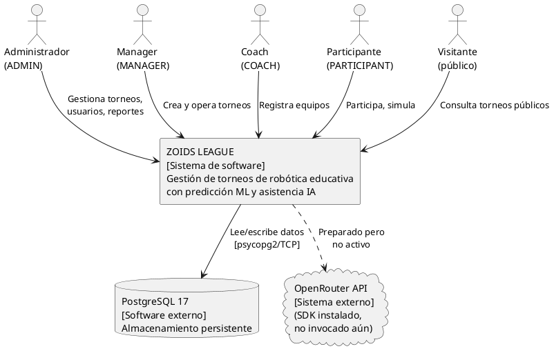
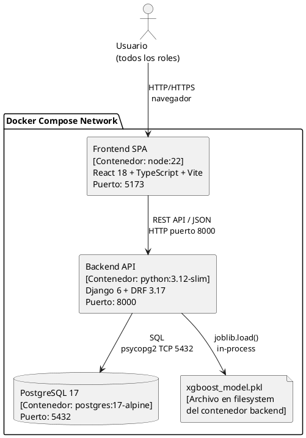
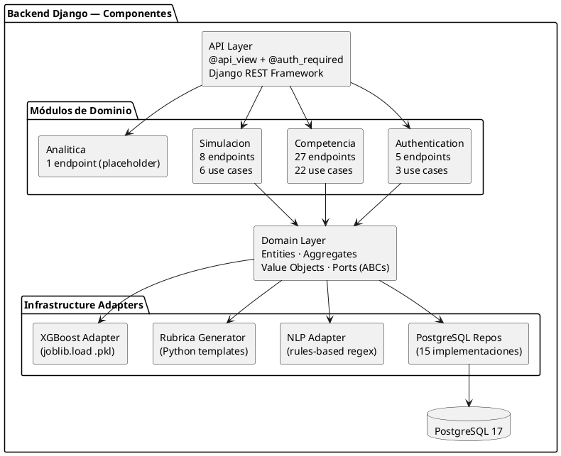

# Arquitectura Empresarial — Zoids League
**Auditor:** Arquitecto Empresarial (Claude Sonnet 4.6)  
**Fecha:** 2026-06-19  
**Fuentes:** Código fuente · Dependencias · Configuración · Logs · Análisis DDD · Inventario funcional

---

## Índice

1. [Visión General](#1-visión-general)
2. [Arquitectura General](#2-arquitectura-general)
3. [Componentes](#3-componentes)
4. [Relaciones entre Componentes](#4-relaciones-entre-componentes)
5. [Dependencias Técnicas](#5-dependencias-técnicas)
6. [Integraciones](#6-integraciones)
7. [Flujo de Datos](#7-flujo-de-datos)
8. [Modelo C4](#8-modelo-c4)
9. [Arquitectura de Despliegue](#9-arquitectura-de-despliegue)
10. [Brechas y Riesgos Arquitectónicos](#10-brechas-y-riesgos-arquitectónicos)

---

## 1. Visión General

**Zoids League** es una plataforma web para la gestión de torneos de robótica educativa. El sistema es un **Monolito Modular** desplegado en contenedores Docker que implementa internamente patrones de **Arquitectura Hexagonal (Ports & Adapters)**, **Clean Architecture** y **Domain-Driven Design** en su capa backend.

### Características arquitectónicas clave

| Dimensión | Decisión |
|---|---|
| **Estilo general** | Monolito modular (un proceso Django, una BD) |
| **Patrón interno** | Hexagonal Architecture + Clean Architecture + DDD |
| **Comunicación** | HTTP REST síncrono (sin colas, sin WebSockets) |
| **Frontend** | SPA desacoplada (React) — cliente puro |
| **Autenticación** | JWT stateless (sin sesiones en servidor) |
| **Persistencia** | PostgreSQL único compartido por todos los módulos |
| **IA/ML** | Local — modelo XGBoost .pkl + reglas NLP en Python |
| **Despliegue** | Docker Compose (3 contenedores) |
| **Escalabilidad** | Vertical únicamente (sin replicación configurada) |

---

## 2. Arquitectura General

### 2.1 Vista de contexto del sistema

```
                         ┌─────────────────────────────────────────────────┐
                         │               CONTEXTO DEL SISTEMA              │
                         │                                                 │
   ┌──────────┐          │   ┌─────────────────────────────────────────┐   │
   │ Admini-  │──────────┼──►│                                         │   │
   │ strador  │          │   │           ZOIDS LEAGUE                  │   │
   └──────────┘          │   │                                         │   │
                         │   │   Gestión de torneos de robótica        │   │
   ┌──────────┐          │   │   educativa con predicción ML           │   │
   │ Manager  │──────────┼──►│   y asistencia IA para configuración   │   │
   └──────────┘          │   │                                         │   │
                         │   └─────────────────────────────────────────┘   │
   ┌──────────┐          │              │              │                    │
   │  Coach   │──────────┼──────────────┘              │                   │
   └──────────┘          │                             ▼                   │
                         │                  ┌─────────────────┐            │
   ┌──────────┐          │                  │   PostgreSQL 17  │            │
   │Participan│──────────┼──────────────────│   (datos del    │            │
   │   te     │          │                  │    sistema)     │            │
   └──────────┘          │                  └─────────────────┘            │
                         │                                                 │
   ┌──────────┐          │              ╔══════════════════╗               │
   │Visitante │──────────┼──────────────║ OpenRouter API   ║               │
   │ público  │  (sin    │              ║ (SDK instalado,  ║               │
   └──────────┘  login)  │              ║ NO USADO aún)   ║               │
                         │              ╚══════════════════╝               │
                         └─────────────────────────────────────────────────┘
```

### 2.2 Diagrama de capas arquitectónicas

```
╔══════════════════════════════════════════════════════════════════════╗
║                          CAPA DE PRESENTACIÓN                        ║
║                                                                      ║
║  React 18.3 + TypeScript 6 + Vite 6.3 + Material UI 7 + Tailwind   ║
║  ┌──────────────────────────────────────────────────────────────┐   ║
║  │  SPA (Single Page Application) — puerto 5173                │   ║
║  │  21 rutas · 10 formularios · Axios HTTP client              │   ║
║  │  JWT en localStorage · React Context (auth state)           │   ║
║  └──────────────────────────────────────────────────────────────┘   ║
╠══════════════════════════════════════════════════════════════════════╣
║                       HTTP REST (JSON)  puerto 8000                  ║
╠══════════════════════════════════════════════════════════════════════╣
║                          CAPA DE API / ENTRADA                       ║
║                                                                      ║
║  Django 6.0.4 + Django REST Framework 3.17.1                       ║
║  ┌──────────────────────────────────────────────────────────────┐   ║
║  │  @api_view decorators · @auth_required (RBAC)               │   ║
║  │  44 endpoints · 4 módulos · serializers DRF                 │   ║
║  └──────────────────────────────────────────────────────────────┘   ║
╠══════════════════════════════════════════════════════════════════════╣
║                        CAPA DE APLICACIÓN                            ║
║                                                                      ║
║  ┌────────────┐ ┌─────────────┐ ┌────────────┐ ┌──────────────┐   ║
║  │   Auth     │ │ Competencia │ │ Simulacion │ │  Analítica   │   ║
║  │ Use Cases  │ │  Use Cases  │ │  Use Cases │ │  Use Cases   │   ║
║  │  (3)       │ │   (22)      │ │   (6)      │ │   (1)        │   ║
║  └────────────┘ └─────────────┘ └────────────┘ └──────────────┘   ║
║                                                                      ║
║  Servicios: PasswordService · JWTService · AuthIdentityService      ║
║             ReentrenamientoService                                   ║
╠══════════════════════════════════════════════════════════════════════╣
║                          CAPA DE DOMINIO                             ║
║                                                                      ║
║  ┌──────────────────────────────────────────────────────────────┐   ║
║  │  Entidades Ricas · Agregados · Value Objects · Puertos ABC  │   ║
║  │                                                              │   ║
║  │  Auth: User (aggregate)                                     │   ║
║  │  Competencia: Tournament · Team · Match · Standing           │   ║
║  │               Criteria · TournamentEvaluation                │   ║
║  │  Simulacion: SimulacionPredictiva · AnalisisEntrega          │   ║
║  └──────────────────────────────────────────────────────────────┘   ║
╠══════════════════════════════════════════════════════════════════════╣
║                       CAPA DE INFRAESTRUCTURA                        ║
║                                                                      ║
║  ┌────────────────┐  ┌────────────────┐  ┌──────────────────────┐  ║
║  │  Repositorios  │  │  Adaptadores   │  │  Adaptadores ML/IA   │  ║
║  │  PostgreSQL    │  │  ORM Django    │  │  XGBoostAdapter      │  ║
║  │  (15 puertos)  │  │  (20 modelos)  │  │  RulesNLPAdapter     │  ║
║  └────────────────┘  └────────────────┘  │  RubricaGenerator    │  ║
║                                          └──────────────────────┘  ║
╠══════════════════════════════════════════════════════════════════════╣
║                       CAPA DE DATOS                                  ║
║                                                                      ║
║  PostgreSQL 17 — instancia única — todos los módulos comparten      ║
║  esquema. Sin separación de schemas por bounded context.             ║
╚══════════════════════════════════════════════════════════════════════╝
```

---

## 3. Componentes

### 3.1 Componente: Frontend SPA

**Tecnología:** React 18.3.1 · TypeScript 6.0.2 · Vite 6.3.5  
**Puerto:** 5173 (desarrollo) / 3000 (Dockerfile incorrecto — bug documentado)  
**Rol:** Cliente HTTP puro. No tiene lógica de negocio. Todo el estado persiste en memoria React o `localStorage`.

| Sub-componente | Responsabilidad |
|---|---|
| **React Router 7.13** | Enrutamiento SPA — 21 rutas, 3 públicas |
| **AuthContext** | Estado global de autenticación (JWT en localStorage) |
| **Axios Instance** (`api.ts`) | Cliente HTTP centralizado con interceptores de token |
| **Material UI 7.3** | Sistema de diseño y componentes visuales |
| **Tailwind CSS 4.1** | Utilidades CSS complementarias |
| **Recharts** | Gráficas (simulación, dashboard KPIs) |
| **Services Layer** | Funciones que envuelven llamadas Axios por dominio |
| **Features** | 21 páginas/vistas organizadas por funcionalidad |

**Interceptores Axios:**
- **Request:** Adjunta `Authorization: Bearer <access_token>` automáticamente
- **Response 401:** Intenta refresh token → si falla, limpia tokens y redirige a `/`

### 3.2 Componente: Backend API (Django)

**Tecnología:** Django 6.0.4 · Python 3.12 · Gunicorn (en requirements, pero `runserver` en Dockerfile)  
**Puerto:** 8000  
**Rol:** API REST + lógica de aplicación + dominio. Monolito con 4 módulos internos.

| Módulo | Bounded Context | Endpoints | Use Cases |
|---|---|---|---|
| `authentication` | Identity | 5 | 3 |
| `competencia` | Tournament | 20 | 22 |
| `simulacion` | Simulation | 8 | 6 |
| `analitica` | Analytics | 1 (placeholder) | 1 |

**Componentes transversales:**
- `config/settings.py` — Configuración central Django
- `config/urls.py` — Router principal (agrega `/api/` prefix)
- `authentication/infrastructure/security/auth_decorator.py` — RBAC con JWT
- `manage.py` — Entry point (llama `load_dotenv()` al inicio)

### 3.3 Componente: Motor de Dominio (Hexagonal)

**Rol:** Núcleo de lógica de negocio. Independiente de frameworks.

```
authentication/domain/
  entities/user.py          → Entidad User (rich domain model)
  ports/user_repository.py  → Puerto de salida (ABC)
  value_objects/            → SystemRol, UserState

competencia/domain/
  entities/                 → Tournament (AR), Team, Match, Participant,
                              Criteria, Standing, TournamentTeam, ...
  ports/                    → 15 ABCs de repositorios y adaptadores
  value_objects/            → ConfigKnockout/RR/Hybrid, TournamentEvaluation,
                              enums (13 enums de negocio)

simulacion/domain/
  entities/                 → SimulacionPredictiva, AnalisisEntrega,
                              SimulacionResultado, SimulationContext
  ports/                    → SimulacionRepositoryPort, TournamentContextPort,
                              RetoAnalisisRepositoryPort
```

### 3.4 Componente: Motor ML (XGBoost)

**Tecnología:** XGBoost 2.1.4 · joblib · numpy  
**Rol:** Predicción de rendimiento de robots basada en métricas de telemetría.

| Sub-componente | Archivo | Descripción |
|---|---|---|
| **XGBoostAdapter** | `simulacion/infrastructure/ml/xgboost_adapter.py` | Carga `xgboost_model.pkl`, expone `predecir(features)` |
| **TrainModel** | `simulacion/infrastructure/ml/train_model.py` | Entrena XGBRegressor (n_estimators=200, max_depth=4, lr=0.05) |
| **ReentrenamientoService** | `simulacion/application/services/reentrenamiento_service.py` | Orquesta reentrenamiento cuando hay ≥ 10 registros reales |

**Features de entrada al modelo:**
- `tiempo_estimado` (float)
- `complejidad_codigo` (int)
- `colisiones_historicas` (int)
- `telemetria_velocidad_prom` (float)
- `telemetria_errores` (int)

**Output:** `puntaje_estimado` + `tiempo_probable_fin` + `rmse_validacion`

### 3.5 Componente: Motor IA / NLP (Rules-based)

**Rol:** Asistencia para configuración de torneos. **Importante:** NO realiza llamadas a LLM. Usa reglas Python y plantillas estáticas.

| Sub-componente | Archivo | Descripción |
|---|---|---|
| **RulesNLPAdapter** | `competencia/infrastructure/ia/rules_nlp_adapter.py` | Regex patterns → extrae campos de texto libre |
| **RubricaGenerator** | `competencia/infrastructure/ia/rubrica_generator.py` | Dict templates por (TipoTorneo, NivelTecnico) → genera criterios con pesos |
| **openai SDK** | Instalado, no usado para LLM | `analisis_engine.py` importa `OpenAI` pero no lo invoca para generación real |

**Flujo NLP:**
```
Texto libre → RulesNLPAdapter → NLPAnalysis (FieldExtraction con confidence)
                    ↓
             Regex patterns:
             - numero_equipos: r'\d+\s*equipos'
             - categoria: r'(explorador|innovador|constructor)'
             - nivel_tecnico: r'(básico|intermedio|avanzado)'
             - tipo_torneo: r'(eliminación|round robin|híbrido)'
```

### 3.6 Componente: Base de Datos (PostgreSQL)

**Tecnología:** PostgreSQL 17 (Docker)  
**Puerto:** 5432 (interno)  
**Rol:** Única fuente de verdad. Todos los módulos acceden a la misma instancia.

| Schema / Prefijo de tabla | Módulo | Tablas principales |
|---|---|---|
| `authentication_` | Auth | `authentication_user` |
| `competencia_` | Competencia | tournament, team, match, standing, criteria, institution, ... |
| `simulacion_` | Simulacion | simulacion_predictiva, simulacion_analisis_entrega, simulacion_resultado |

**Sin separación por esquemas PostgreSQL** — todos los módulos comparten el esquema `public`. Sin sharding, sin read replicas configuradas.

### 3.7 Componente: Infraestructura Docker

**Tecnología:** Docker Engine · Docker Compose v3  
**Rol:** Orquestación de los 3 servicios en un único host.

```yaml
services:
  db:       PostgreSQL 17-alpine  → puerto 5432
  backend:  python:3.12-slim      → puerto 8000
  frontend: node:22               → puerto 5173
```

---

## 4. Relaciones entre Componentes

### 4.1 Mapa de relaciones principal

```
┌──────────────────────────────────────────────────────────────────────────────┐
│                         MAPA DE COMPONENTES Y RELACIONES                     │
│                                                                              │
│   ┌─────────────────────────────────────────────────────────────────┐        │
│   │                     FRONTEND (SPA)                              │        │
│   │   Browser ──► React Router ──► Páginas/Features                │        │
│   │                    │                                            │        │
│   │               AuthContext ◄──── localStorage (JWT)             │        │
│   │                    │                                            │        │
│   │            Services Layer                                       │        │
│   │                    │                                            │        │
│   │            Axios Instance                                       │        │
│   │            ├── Interceptor Request (añade Bearer)              │        │
│   │            └── Interceptor Response (401 → refresh/logout)     │        │
│   └──────────────────────┬──────────────────────────────────────────┘        │
│                          │ HTTP REST / JSON                                  │
│                          │ puerto 8000                                       │
│   ┌──────────────────────▼──────────────────────────────────────────┐        │
│   │                     BACKEND (Django)                            │        │
│   │                                                                 │        │
│   │   ┌────────────┐   ┌────────────┐   ┌──────────┐   ┌──────┐  │        │
│   │   │   /auth/   │   │/competencia│   │/simulacion│   │ /ia/ │  │        │
│   │   │  (5 ep)    │   │  (20 ep)   │   │  (8 ep)  │   │(7 ep)│  │        │
│   │   └─────┬──────┘   └─────┬──────┘   └────┬─────┘   └──┬───┘  │        │
│   │         │                │               │             │        │        │
│   │         └────────────────┴───────────────┴─────────────┘        │        │
│   │                                   │                              │        │
│   │                          @auth_required                          │        │
│   │                          (JWT verify + RBAC)                    │        │
│   │                                   │                              │        │
│   │                          Use Cases Layer                         │        │
│   │                                   │                              │        │
│   │                          Domain Layer                            │        │
│   │                          (Entities + Ports)                      │        │
│   │                                   │                              │        │
│   │        ┌──────────────────────────┼────────────────────┐        │        │
│   │        │                          │                    │        │        │
│   │        ▼                          ▼                    ▼        │        │
│   │  Repositorios             ML Adapter            NLP/IA Engine  │        │
│   │  PostgreSQL               (XGBoost.pkl)         (Rules-based)  │        │
│   └──────────────────────────┬────────────────────────────────────── ┘        │
│                              │ psycopg2 (TCP 5432)                          │
│   ┌──────────────────────────▼──────────────────────────────────────┐        │
│   │                  PostgreSQL 17                                   │        │
│   │   authentication_user                                           │        │
│   │   competencia_tournament · competencia_team · competencia_match │        │
│   │   simulacion_predictiva · simulacion_resultado                  │        │
│   └─────────────────────────────────────────────────────────────────┘        │
└──────────────────────────────────────────────────────────────────────────────┘
```

### 4.2 Relaciones entre módulos internos del backend

```
                    ┌─────────────────────────────────────────────────────┐
                    │                   BACKEND INTERNO                   │
                    │                                                     │
                    │  ┌─────────────┐                                   │
                    │  │authentication│◄──── IMPORTA domain.value_objects │
                    │  │  (BC Auth)   │        (SystemRol, UserState)     │
                    │  └──────┬───────┘                                   │
                    │         │ cross-context import (violación DDD)      │
                    │         ▼                                           │
                    │  ┌──────────────┐     ┌─────────────────┐          │
                    │  │ competencia  │     │   simulacion    │          │
                    │  │  (BC Core)   │◄────│   (BC Sim)      │          │
                    │  │              │     │                 │          │
                    │  │  Tournament  │     │  Usa TournamentContext     │
                    │  │  Team        │     │  (accede a modelos de     │
                    │  │  Match       │     │  competencia vía ORM)     │
                    │  │  Standing    │     └─────────────────┘          │
                    │  │  Criteria    │                                   │
                    │  └──────┬───────┘     ┌─────────────────┐          │
                    │         │             │    analitica    │          │
                    │         └────────────►│   (placeholder) │          │
                    │                       └─────────────────┘          │
                    │                                                     │
                    │  ┌────────────────────────────────────────────┐    │
                    │  │           COMPARTIDO (ORM / DB)            │    │
                    │  │   Un único schema PostgreSQL               │    │
                    │  │   Todos los módulos acceden directamente   │    │
                    │  └────────────────────────────────────────────┘    │
                    └─────────────────────────────────────────────────────┘
```

### 4.3 Relación Frontend ↔ Backend por dominio

| Frontend (Llamada) | Backend (Endpoint) | Módulo |
|---|---|---|
| `loginUser()` | `POST /api/auth/login/` | authentication |
| `registerUser()` | `POST /api/auth/register/` | authentication |
| `refreshAccessToken()` | `POST /api/auth/refresh/` | authentication |
| `getTournaments()` | `GET /api/competencia/all/` | competencia |
| `createTournament()` | `POST /api/competencia/create/` | competencia |
| `registerTeam()` | `POST /api/competencia/torneo/{id}/inscribir/` | competencia |
| `approveTeam()` | `POST /api/competencia/equipo/{id}/aprobar/` | competencia |
| `generateFixtures()` | `POST /api/competencia/torneo/{id}/generar-fixtures/` | competencia |
| `registerMatchResults()` | `POST /api/competencia/partido/{id}/resultado/` | competencia |
| `getPublicTournamentData()` | `GET /api/competencia/torneo/{id}/public/` | competencia |
| `analizarTexto()` | `POST /api/ia/analizar` | competencia/ia |
| `generarCriteriosEvaluacion()` | `POST /api/ia/generar-criterios` | competencia/ia |
| `getSimulationContext()` | `GET /api/simulacion/torneo/{id}/contexto/` | simulacion |
| `runSimulation()` | `POST /api/simulacion/torneo/{id}/simular/` | simulacion |

---

## 5. Dependencias Técnicas

### 5.1 Árbol de dependencias completo

```
SISTEMA ZOIDS LEAGUE
│
├── FRONTEND
│   ├── React 18.3.1 ─────────────────── UI framework
│   │   ├── react-dom 18.3.1
│   │   └── react-router-dom 7.13.0 ─── Routing SPA
│   │
│   ├── TypeScript 6.0.2 ──────────────── Tipado estático
│   ├── Vite 6.3.5 ────────────────────── Build tool + dev server
│   │
│   ├── Material UI 7.3.5 ─────────────── Design system
│   │   └── @emotion/react, @emotion/styled
│   │
│   ├── Tailwind CSS 4.1.12 ────────────── Utilidades CSS
│   ├── Axios 1.15.0 ──────────────────── HTTP client (⚠️ CVEs)
│   ├── Recharts 2.x ──────────────────── Charts
│   ├── jwt-decode 4.x ─────────────────── JWT client-side decode
│   └── lucide-react ──────────────────── Iconos SVG
│
├── BACKEND
│   ├── Python 3.12 ───────────────────── Runtime (⚠️ host tiene 3.14)
│   │
│   ├── Django 6.0.4 ──────────────────── Web framework
│   │   ├── asgiref 3.11.1 ─────────────── ASGI support
│   │   └── sqlparse 0.5.5 ─────────────── SQL formatting
│   │
│   ├── djangorestframework 3.17.1 ──────── REST API
│   ├── django-cors-headers 4.9.0 ──────── CORS
│   ├── whitenoise 6.12.0 ──────────────── Static files
│   ├── gunicorn 26.0.0 ────────────────── WSGI server (instalado, no usado en CMD)
│   │
│   ├── psycopg2-binary 2.9.12 ─────────── PostgreSQL driver
│   │   └── (también psycopg2 2.9.12 — duplicado ⚠️)
│   │
│   ├── PyJWT 2.12.1 ───────────────────── JWT encode/decode
│   ├── bcrypt 5.0.0 ───────────────────── Password hashing
│   ├── passlib 1.7.4 ──────────────────── Password utilities (⚠️ abandonado)
│   ├── djangorestframework_simplejwt 5.5.1 ── JWT utils (no usado directamente)
│   │
│   ├── openai ≥1.0.0 ──────────────────── SDK instalado (⚠️ no genera LLM aún)
│   ├── python-dotenv ≥1.0.0 ───────────── Variables de entorno
│   │
│   ├── ML Stack
│   │   ├── xgboost 2.1.4 ──────────────── Modelo predictivo
│   │   ├── numpy 1.26.4 ───────────────── Arrays numéricos (⚠️ instala 2.4.6 en Py3.14)
│   │   ├── scikit-learn 1.6.1 ─────────── (⚠️ no instalable sin compilador C en Py3.14)
│   │   └── joblib 1.4.2 ───────────────── Serialización del modelo
│   │
│   └── coverage 7.x ──────────────────── (⚠️ en reqs de producción, es tool de dev)
│
└── INFRAESTRUCTURA
    ├── Docker Engine
    ├── Docker Compose v3
    │   ├── service: db (postgres:17-alpine)
    │   ├── service: backend (python:3.12-slim)
    │   └── service: frontend (node:22)
    └── PostgreSQL 17
```

### 5.2 Cadena de dependencias críticas en arranque

```
Django startup (manage.py)
       │
       ├── load_dotenv() ← .env file
       │
       └── URL routing (config/urls.py)
               │
               ├── auth.urls
               ├── competencia.urls
               └── simulacion.urls
                       │
                       └── simulacion/views.py
                               │
                               ├── xgboost_adapter.py
                               │       └── import joblib  ← BLOQUEANTE si falta
                               │
                               └── analisis_engine.py
                                       └── from openai import OpenAI  ← BLOQUEANTE si falta
```

Si `joblib` u `openai` no están instalados → **Django no arranca en absoluto**.

### 5.3 Matriz de dependencias entre capas

```
              Domain  Application  Infrastructure  API Layer  Frontend
Domain          ─         ←             ←              ←         ←
Application     →         ─             ←              ←         ←
Infrastructure  →         →             ─              ←         ←
API Layer       →         →             →              ─         ←
Frontend        →         →             →              →         ─

→ depende de   ← es usado por   ─ misma capa
```

**Regla satisfecha:** Las dependencias siempre apuntan hacia adentro (Domain nunca importa Application ni Infrastructure). Verificado en código.

---

## 6. Integraciones

### 6.1 Mapa de integraciones

```
┌─────────────────────────────────────────────────────────────────────────┐
│                       MAPA DE INTEGRACIONES                             │
│                                                                         │
│                    ┌─────────────────┐                                  │
│                    │  ZOIDS LEAGUE   │                                  │
│                    │    SISTEMA      │                                  │
│                    └────────┬────────┘                                  │
│                             │                                           │
│         ┌───────────────────┼───────────────────┐                      │
│         │                   │                   │                      │
│         ▼                   ▼                   ▼                      │
│  ╔══════════════╗  ╔════════════════╗  ╔═════════════════════╗         │
│  ║ PostgreSQL   ║  ║  OpenRouter    ║  ║  Modelo XGBoost     ║         │
│  ║ 17 (interna) ║  ║  API (externa) ║  ║  (.pkl file local)  ║         │
│  ║              ║  ║                ║  ║                     ║         │
│  ║  Tipo:       ║  ║  Tipo:         ║  ║  Tipo:              ║         │
│  ║  Síncrona    ║  ║  HTTP REST     ║  ║  In-process         ║         │
│  ║  TCP/5432    ║  ║  (NO ACTIVA    ║  ║  (joblib.load)      ║         │
│  ║  psycopg2    ║  ║  actualmente)  ║  ║                     ║         │
│  ╚══════════════╝  ╚════════════════╝  ╚═════════════════════╝         │
│                                                                         │
│  Estado de integraciones:                                               │
│  ✅ PostgreSQL — ACTIVA (requerida)                                     │
│  ⚠️  OpenRouter — PREPARADA pero no invocada (código de integración    │
│      existente en analisis_engine.py, OPENROUTER_API_KEY en .env)       │
│  ✅ XGBoost local — ACTIVA (carga desde path relativo)                 │
│  ❌ Email/SMTP — NO implementado (logout sin notificación)              │
│  ❌ Almacenamiento de archivos — NO implementado (S3/local)             │
│  ❌ Notificaciones en tiempo real — NO implementado (sin WebSockets)    │
└─────────────────────────────────────────────────────────────────────────┘
```

### 6.2 Detalle de integraciones

#### Integración 1: PostgreSQL (ACTIVA)

| Dimensión | Detalle |
|---|---|
| **Tipo** | Síncrona, TCP |
| **Driver** | psycopg2-binary 2.9.12 |
| **Host** | `DB_HOST` (env var, default `localhost`) |
| **Puerto** | `DB_PORT` (env var, default `5432`) |
| **Credenciales** | `DB_USER`, `DB_PASSWORD` (env vars) |
| **Riesgo** | docker-compose.yml hardcodea `admin`/`admin` — ignora env vars |
| **Connection pool** | Django por defecto (sin configuración explícita) |
| **Timeout** | No configurado — workers pueden quedar colgados |
| **SSL** | No configurado — conexión en claro |

#### Integración 2: OpenRouter API (PREPARADA, NO ACTIVA)

| Dimensión | Detalle |
|---|---|
| **Tipo** | HTTP REST (HTTPS) |
| **SDK** | `openai` ≥1.0.0 (compatible con OpenRouter) |
| **Configuración** | `OPENROUTER_API_KEY` en .env / docker-compose.yml |
| **Estado actual** | `analisis_engine.py` importa `OpenAI` pero no la invoca para generación de texto |
| **Uso real** | `rubrica_generator.py` usa plantillas Python — sin LLM |
| **Propósito futuro** | Generación de criterios y análisis de código con LLM |

#### Integración 3: Modelo XGBoost Local (ACTIVA)

| Dimensión | Detalle |
|---|---|
| **Tipo** | In-process (Python) |
| **Mecanismo** | `joblib.load('xgboost_model.pkl')` |
| **Path** | Relativo hardcodeado en `xgboost_adapter.py` |
| **Fallo** | `RuntimeError` si el archivo .pkl no existe |
| **Entrenamiento** | `train_model.py` — XGBRegressor (200 estimadores, depth 4, lr 0.05) |
| **Reentrenamiento** | Requiere ≥ 10 registros reales en `FinalRanking` |

### 6.3 Integraciones faltantes (brechas)

| Integración | Impacto | Prioridad |
|---|---|---|
| **Sistema de notificaciones** | Sin notificaciones de aprobación de equipo, inicio de torneo | Alta |
| **WebSockets / SSE** | Sin actualizaciones en tiempo real de resultados | Media |
| **SMTP / Email** | Sin confirmación de registro, reset de contraseña | Alta |
| **Almacenamiento de archivos** | Sin subida de fotos, documentos de inscripción | Media |
| **Monitoreo / APM** | Sin Prometheus, Sentry, Datadog | Alta |
| **Cache (Redis)** | Sin caché — cada request consulta BD | Media |

---

## 7. Flujo de Datos

### 7.1 Flujo 1: Autenticación y acceso protegido

```
Browser                 Frontend SPA              Backend Django           PostgreSQL
   │                        │                          │                       │
   │  Ingresa email/pass     │                          │                       │
   ├───────────────────────►│                          │                       │
   │                        │  POST /api/auth/login/   │                       │
   │                        ├─────────────────────────►│                       │
   │                        │  {email, password}       │  SELECT user WHERE    │
   │                        │                          │  email = ?            │
   │                        │                          ├──────────────────────►│
   │                        │                          │◄──────────────────────┤
   │                        │                          │  bcrypt.verify()      │
   │                        │                          │  user.reset_attempts()│
   │                        │                          │  UPDATE user          │
   │                        │                          ├──────────────────────►│
   │                        │  200 {access_token,      │                       │
   │                        │  refresh_token, user}    │                       │
   │                        │◄─────────────────────────┤                       │
   │                        │                          │                       │
   │                        │ localStorage.setItem()   │                       │
   │                        │ AuthContext.setUser()    │                       │
   │◄───────────────────────┤                          │                       │
   │  Dashboard visible      │                          │                       │
   │                        │                          │                       │
   │  Navega a página        │                          │                       │
   ├───────────────────────►│                          │                       │
   │                        │  GET /api/competencia/   │                       │
   │                        │  all/                    │                       │
   │                        │  + Authorization: Bearer │                       │
   │                        │  <access_token>          │                       │
   │                        ├─────────────────────────►│                       │
   │                        │                          │  @auth_required:      │
   │                        │                          │  jwt.decode(token)    │
   │                        │                          │  verificar roles      │
   │                        │                          │  SELECT tournaments   │
   │                        │                          ├──────────────────────►│
   │                        │  200 [tournaments...]    │◄──────────────────────┤
   │                        │◄─────────────────────────┤                       │
   │◄───────────────────────┤                          │                       │
   │  Lista de torneos       │                          │                       │
```

### 7.2 Flujo 2: Creación y configuración de torneo

```
Manager                 Frontend                  Backend                  DB
   │                       │                          │                     │
   │  POST crear torneo     │                          │                     │
   ├──────────────────────►│                          │                     │
   │                       │ POST /api/competencia/   │                     │
   │                       │ create/                  │                     │
   │                       │ {name, dates, max_teams, │                     │
   │                       │  categorias}             │                     │
   │                       ├─────────────────────────►│                     │
   │                       │                          │ CreateTournamentUC  │
   │                       │                          │ Tournament.create() │
   │                       │                          │ → state: DRAFT      │
   │                       │                          │ INSERT tournament   │
   │                       │                          ├────────────────────►│
   │                       │  201 {tournament}        │                     │
   │                       │◄─────────────────────────┤                     │
   │◄──────────────────────┤                          │                     │
   │                       │                          │                     │
   │  Pega descripción en   │                          │                     │
   │  Asistente IA          │                          │                     │
   ├──────────────────────►│                          │                     │
   │                       │ POST /api/ia/analizar    │                     │
   │                       │ {texto: "..."}           │                     │
   │                       ├─────────────────────────►│                     │
   │                       │                          │ RulesNLPAdapter     │
   │                       │                          │ .analyze(texto)     │
   │                       │                          │ → NLPAnalysis       │
   │                       │                          │ (regex, NO LLM)     │
   │                       │                          │ INSERT nlp_analysis │
   │                       │                          ├────────────────────►│
   │                       │  200 {campos extraídos,  │                     │
   │                       │   confidence scores}     │                     │
   │                       │◄─────────────────────────┤                     │
   │◄──────────────────────┤                          │                     │
   │  Formulario autocompletado                       │                     │
   │                       │                          │                     │
   │  Genera criterios IA  │                          │                     │
   ├──────────────────────►│                          │                     │
   │                       │ POST /api/ia/            │                     │
   │                       │ generar-criterios        │                     │
   │                       │ {tipo, nivel, categoria} │                     │
   │                       ├─────────────────────────►│                     │
   │                       │                          │ RubricaGenerator    │
   │                       │                          │ .generar(...)       │
   │                       │                          │ → plantilla Python  │
   │                       │                          │   por (tipo, nivel) │
   │                       │                          │ INSERT criterios_ia │
   │                       │                          ├────────────────────►│
   │                       │  200 {sesion_ia_id,      │                     │
   │                       │   criterios[]}           │                     │
   │                       │◄─────────────────────────┤                     │
   │◄──────────────────────┤                          │                     │
   │  Ajusta pesos          │                          │                     │
   ├──────────────────────►│ PUT /api/ia/criterios/id │                     │
   │                       ├─────────────────────────►│ UPDATE criterio_ia  │
   │                       │◄─────────────────────────┤────────────────────►│
   │  Confirma criterios    │                          │                     │
   ├──────────────────────►│ POST /api/ia/criterios/  │                     │
   │                       │ {sesion}/confirmar       │                     │
   │                       ├─────────────────────────►│ validar suma=100%   │
   │                       │                          │ UPDATE all ACEPTADO │
   │                       │◄─────────────────────────┤────────────────────►│
```

### 7.3 Flujo 3: Generación de fixtures y calificación

```
Admin                   Frontend                  Backend                  DB
  │                        │                          │                     │
  │  Genera fixtures        │                          │                     │
  ├───────────────────────►│                          │                     │
  │                        │ POST torneo/{id}/        │                     │
  │                        │ generar-fixtures/        │                     │
  │                        ├─────────────────────────►│                     │
  │                        │                          │ GenerateFixturesUC  │
  │                        │                          │ tournament.set_teams│
  │                        │                          │ _generate_knockout()│
  │                        │                          │ → árbol de partidos │
  │                        │                          │ partido_siguiente_id│
  │                        │                          │ enlazado en memoria │
  │                        │                          │                     │
  │                        │                          │ transaction.atomic()│
  │                        │                          │ DELETE matches old  │
  │                        │                          │ INSERT matches[]    │
  │                        │                          ├────────────────────►│
  │                        │  200 [matches...]        │                     │
  │                        │◄─────────────────────────┤                     │
  │◄───────────────────────┤                          │                     │
  │  Ve bracket             │                          │                     │
  │                        │                          │                     │
  │  Registra resultado     │                          │                     │
  │  de partido             │                          │                     │
  ├───────────────────────►│                          │                     │
  │                        │ POST partido/{id}/       │                     │
  │                        │ resultado/               │                     │
  │                        │ {qualifications[]}       │                     │
  │                        ├─────────────────────────►│                     │
  │                        │                          │ QualifyMatchUC      │
  │                        │                          │                     │
  │                        │                          │ por cada criterio:  │
  │                        │                          │ evaluation          │
  │                        │                          │ .qualify_score()    │
  │                        │                          │ valor_norm = val*peso│
  │                        │                          │ INSERT match_result │
  │                        │                          ├────────────────────►│
  │                        │                          │                     │
  │                        │                          │ si todos criterios  │
  │                        │                          │ calificados:        │
  │                        │                          │ score = Σ(val*peso) │
  │                        │                          │ winner = argmax     │
  │                        │                          │ UPDATE match FINISHED│
  │                        │                          ├────────────────────►│
  │                        │                          │                     │
  │                        │                          │ si hay partido_sig: │
  │                        │                          │ asignar ganador al  │
  │                        │                          │ local/visitante del │
  │                        │                          │ siguiente partido   │
  │                        │                          │ UPDATE next_match   │
  │                        │                          ├────────────────────►│
  │                        │                          │                     │
  │                        │                          │ si es FINAL:        │
  │                        │                          │ tournament.finish() │
  │                        │                          │ UPDATE tournament   │
  │                        │                          │ state=FINALIZED     │
  │                        │                          ├────────────────────►│
  │                        │  200 void                │                     │
  │                        │◄─────────────────────────┤                     │
```

### 7.4 Flujo 4: Simulación de participante (ML + rules)

```
Participante            Frontend                  Backend              DB / Archivo
     │                     │                          │                     │
     │  Abre Simulación     │                          │                     │
     ├────────────────────►│                          │                     │
     │                     │ GET simulacion/torneo/   │                     │
     │                     │ {id}/contexto/           │                     │
     │                     ├─────────────────────────►│                     │
     │                     │                          │ TournamentContextRepo│
     │                     │                          │ SELECT tournament    │
     │                     │                          │ + criteria          │
     │                     │                          │ + team (approved)   │
     │                     │                          │ prefetch_related()  │
     │                     │                          ├────────────────────►│
     │                     │  200 SimulationContext   │                     │
     │                     │◄─────────────────────────┤                     │
     │◄────────────────────┤                          │                     │
     │                     │                          │                     │
     │  Escribe entregable  │                          │                     │
     │  (≥100 chars)       │                          │                     │
     ├────────────────────►│                          │                     │
     │                     │ POST simulacion/torneo/  │                     │
     │                     │ {id}/simular/            │                     │
     │                     │ {entregable: "..."}      │                     │
     │                     ├─────────────────────────►│                     │
     │                     │                          │ EjecutarSimulacionUC│
     │                     │                          │                     │
     │                     │                          │ ejecutar_scoring()  │
     │                     │                          │ (rules-based NLP:   │
     │                     │                          │  regex sobre texto) │
     │                     │                          │                     │
     │                     │                          │ calcular_scores()   │
     │                     │                          │ → puntaje ponderado │
     │                     │                          │                     │
     │                     │                          │ calcular_posicion() │
     │                     │                          │ → percentil estimado│
     │                     │                          │                     │
     │                     │                          │ generar_retro()     │
     │                     │                          │                     │
     │                     │                          │ INSERT SimResult    │
     │                     │                          ├────────────────────►│
     │                     │  200 {scores,            │                     │
     │                     │  puntaje_total,          │                     │
     │                     │  posicion, percentil,    │                     │
     │                     │  fortalezas, debilidades,│                     │
     │                     │  retroalimentacion}      │                     │
     │                     │◄─────────────────────────┤                     │
     │◄────────────────────┤                          │                     │
     │  Gráfico de barras   │                          │                     │
     │  + retroalimentación │                          │                     │
```

### 7.5 Flujo de datos de autenticación JWT (ciclo de vida del token)

```
┌────────────────────────────────────────────────────────────────────┐
│                    CICLO DE VIDA JWT                               │
│                                                                    │
│  Login exitoso                                                     │
│  └──► access_token (15 min, HS256, payload: user_id/email/rol)    │
│  └──► refresh_token (7 días, HS256, payload: user_id)             │
│         │                                                          │
│         └──► localStorage en el browser                           │
│                                                                    │
│  Request → Interceptor Axios añade:                               │
│  Authorization: Bearer <access_token>                             │
│         │                                                          │
│         └──► @auth_required en Django:                            │
│              1. Extrae Bearer token del header                    │
│              2. jwt.decode(token, SECRET_KEY, HS256)              │
│              3. Verifica payload.type == "access"                 │
│              4. Verifica rol en allowed_roles[]                   │
│              5. Reconstruye User desde JWT payload               │
│                                                                    │
│  Si 401 → Interceptor Axios Response:                             │
│  1. Cola de requests pendientes                                   │
│  2. POST /api/auth/refresh/ con refresh_token                    │
│  3. Si OK: nuevo access_token → reintentar cola                  │
│  4. Si falla: clearTokens() + redirect a "/"                     │
│                                                                    │
│  Logout:                                                           │
│  PUT /api/auth/logout/ (⚠️ no invalida token en servidor)        │
│  └──► Solo borra tokens del localStorage                          │
│  └──► Token sigue válido 15min hasta expirar naturalmente        │
└────────────────────────────────────────────────────────────────────┘
```

---

## 8. Modelo C4

### 8.1 Nivel 1 — Contexto del Sistema



### 8.2 Nivel 2 — Contenedores



### 8.3 Nivel 3 — Componentes del Backend



---

## 9. Arquitectura de Despliegue

### 9.1 Infraestructura actual (Docker Compose)

```
┌─────────────────────────────────────────────────────────────────────────┐
│                        HOST ÚNICO (servidor/VM)                         │
│                                                                         │
│  ┌───────────────────────────────────────────────────────────────────┐  │
│  │                    Docker Compose Network                         │  │
│  │                                                                   │  │
│  │  ┌──────────────────────┐                                         │  │
│  │  │  frontend            │                                         │  │
│  │  │  node:22             │                                         │  │
│  │  │                      │                                         │  │
│  │  │  npm run dev --host  │◄──── Puerto 5173:5173 (host:container) │  │
│  │  │  Vite dev server     │                                         │  │
│  │  │                      │                                         │  │
│  │  │  ⚠️ EXPOSE 3000 (bug) │                                         │  │
│  │  └──────────┬───────────┘                                         │  │
│  │             │ HTTP requests                                        │  │
│  │             ▼                                                      │  │
│  │  ┌──────────────────────┐          ┌──────────────────────────┐   │  │
│  │  │  backend             │          │  Volúmenes               │   │  │
│  │  │  python:3.12-slim    │          │                          │   │  │
│  │  │                      │          │  /app/                   │   │  │
│  │  │  python manage.py    │◄─────────│  (código fuente)         │   │  │
│  │  │  runserver 0:8000    │          │                          │   │  │
│  │  │                      │          │  xgboost_model.pkl       │   │  │
│  │  │  ⚠️ runserver ≠       │          │  (necesario para ML)     │   │  │
│  │  │    gunicorn (prod)   │          └──────────────────────────┘   │  │
│  │  │                      │                                         │  │
│  │  │  Puerto 8000:8000    │                                         │  │
│  │  └──────────┬───────────┘                                         │  │
│  │             │ psycopg2 TCP                                         │  │
│  │             ▼                                                      │  │
│  │  ┌──────────────────────┐                                         │  │
│  │  │  db                  │          ┌──────────────────────────┐   │  │
│  │  │  postgres:17-alpine  │          │  Volúmenes               │   │  │
│  │  │                      │◄─────────│                          │   │  │
│  │  │  POSTGRES_DB:zleague │          │  postgres_data:/var/lib/ │   │  │
│  │  │  POSTGRES_USER:admin │          │  postgresql/data         │   │  │
│  │  │  POSTGRES_PASS:admin │          │  (persistencia)          │   │  │
│  │  │  ⚠️ hardcodeado      │          └──────────────────────────┘   │  │
│  │  │                      │                                         │  │
│  │  │  Puerto 5432:5432    │                                         │  │
│  │  └──────────────────────┘                                         │  │
│  │                                                                   │  │
│  └───────────────────────────────────────────────────────────────────┘  │
│                                                                         │
│  Sin: Load Balancer · Nginx reverse proxy · SSL Termination             │
│  Sin: CI/CD Pipeline · Health dashboard · Log aggregation               │
└─────────────────────────────────────────────────────────────────────────┘
```

### 9.2 Arquitectura de producción necesaria (vs. actual)

```
ACTUAL                              RECOMENDADO
──────                              ───────────

Internet                            Internet
   │                                   │
   ▼                                   ▼
[Docker Compose]               [Load Balancer / CDN]
  backend:8000 (directo)              │
  frontend:5173 (Vite dev)    ┌───────┴────────┐
                              │                │
                              ▼                ▼
                         [Nginx]          [CDN/S3]
                         reverse proxy    Static assets
                              │           (frontend build)
                              ▼
                         [Gunicorn]
                         múltiples workers
                              │
                     ┌────────┴────────┐
                     ▼                 ▼
               [PostgreSQL]       [Redis Cache]
               primary+replica   sessions + cache
```

### 9.3 Variables de entorno requeridas

| Variable | Obligatoria | Fuente actual | Riesgo |
|---|---|---|---|
| `DJANGO_SECRET_KEY` | Sí | `.env` file | 🔴 Fallback hardcodeado en settings.py |
| `DJANGO_DEBUG` | Sí | `.env` file | 🔴 Default True |
| `DB_NAME` | Sí | `.env` file | ✅ OK |
| `DB_USER` | Sí | `.env` file | ✅ OK |
| `DB_PASSWORD` | Sí | `.env` / docker-compose | 🔴 docker-compose.yml hardcodea 'admin' |
| `DB_HOST` | Sí | `.env` file | ✅ OK |
| `DB_PORT` | No | `.env` file | ✅ OK |
| `OPENROUTER_API_KEY` | No | `.env` / docker-compose | ⚠️ SDK listo, no activo |
| `VITE_API_URL` | Sí (frontend) | `.env.template` | ⚠️ Fallback hardcodeado en api.ts |
| `DJANGO_ALLOWED_HOSTS` | Sí (prod) | `.env` file | ✅ OK |
| `LOG_LEVEL` | No | `.env` file | ✅ OK |

---

## 10. Brechas y Riesgos Arquitectónicos

### 10.1 Riesgos por severidad

```
CRÍTICOS ██████████████████████████████████████████
│
├── [RC-01] SECRET_KEY con fallback hardcodeado
│           → Todos los JWT generados con clave pública si no hay .env
│           → Cualquiera puede forjar tokens de cualquier rol
│
├── [RC-02] Credenciales DB hardcodeadas en docker-compose.yml
│           → admin/admin versionado en git
│           → No lee variables del .env para postgres password
│
├── [RC-03] Django runserver en producción
│           → Un solo thread, sin concurrencia, sin manejo de errores
│           → Gunicorn instalado pero no configurado en CMD
│
├── [RC-04] Sin SSL/TLS configurado
│           → DB en claro, frontend en HTTP, tokens JWT expuestos
│
├── [RC-05] 4 CVEs HIGH en axios (frontend)
│           → Prototype Pollution, SSRF, Header Injection, Auth Bypass
│
└── [RC-06] react-router 7.0-7.15: RCE potencial
            → Unauth RCE via TYPE_ERROR deserialization

ALTOS ██████████████████████████████
│
├── [RA-01] Sin invalidación de tokens en logout
│           → Token válido 15min/7días después de logout
│
├── [RA-02] Imports ML/IA eager bloquean Django completo
│           → Una librería faltante = 0 endpoints disponibles
│
├── [RA-03] Sin CI/CD pipeline
│           → Despliegues manuales, sin tests automatizados en pipeline
│
├── [RA-04] Sin monitoreo ni observabilidad
│           → Errores silenciosos en producción
│
├── [RA-05] Vite ≤6.4.2: Path Traversal en dev server
│           → Lectura arbitraria de archivos del servidor
│
├── [RA-06] Sin sistema de notificaciones
│           → Cambios de estado (aprobación, inicio de torneo)
│           → sin comunicación al usuario
│
└── [RA-07] Sin caché
            → Cada request consulta PostgreSQL directamente
            → N+1 queries potenciales en vistas de torneo

MEDIOS ████████████████████
│
├── [RM-01] EXPOSE 3000 incorrecto en frontend Dockerfile
├── [RM-02] psycopg2 + psycopg2-binary ambos en requirements
├── [RM-03] coverage en requirements de producción
├── [RM-04] passlib abandonado
├── [RM-05] numpy/xgboost versión diferente (Py3.14)
├── [RM-06] Sin timeout en conexiones DB y Axios
├── [RM-07] Sin validación de rate limiting en login
├── [RM-08] Sin paginación en endpoints de listado
└── [RM-09] TournamentTeam.add_participant() → AttributeError en runtime

BAJOS ████████
│
├── [RB-01] pip desactualizado
├── [RB-02] print() de debug en QualifyMatchUseCase
├── [RB-03] djangorestframework_simplejwt instalado pero no usado
└── [RB-04] openai SDK instalado para integración futura no activa
```

### 10.2 Deuda técnica arquitectónica

| Categoría | Deuda | Impacto |
|---|---|---|
| **Seguridad** | JWT sin revocación server-side | Alto |
| **Seguridad** | SECRET_KEY fallback hardcodeado | Crítico |
| **Escalabilidad** | Sin caché (Redis/Memcached) | Alto |
| **Escalabilidad** | Sin configuración de connection pool | Medio |
| **Resiliencia** | Sin circuit breaker para OpenRouter | Bajo |
| **Observabilidad** | Sin logging estructurado centralizado | Alto |
| **Testing** | 64 tests encontrados, ninguno ejecutado (sin DB) | Alto |
| **DDD** | Cross-context import (auth → competencia) | Medio |
| **DDD** | Unit of Work definido pero no implementado | Medio |
| **Frontend** | 15 errores TypeScript (6 compilación bloqueante si strict) | Bajo |
| **Docs** | Sin API documentation (Swagger/OpenAPI) | Medio |

### 10.3 Roadmap de madurez arquitectónica

```
ESTADO ACTUAL                    → ESTADO OBJETIVO
──────────────                     ───────────────

Monolito con Docker Compose        Monolito productivo hardened
Sin CI/CD                     →    Pipeline CI/CD (GitHub Actions)
runserver Django               →    Gunicorn + Nginx
Sin SSL                        →    HTTPS con certificados
Sin caché                      →    Redis para cache y sesiones
JWT sin revocación             →    Token blocklist en Redis
Sin monitoreo                  →    Sentry + Prometheus + Grafana
Sin paginación                 →    Cursor-based pagination en API
Sin rate limiting              →    django-ratelimit o throttling DRF
Credenciales hardcodeadas      →    Secrets Manager / .env seguro
openai SDK preparado           →    Integración real con OpenRouter
Sin WebSockets                 →    Django Channels para tiempo real
```

---

## Resumen Ejecutivo

**Zoids League** implementa una arquitectura de **Monolito Modular** bien estructurada internamente. El backend Django aplica correctamente los patrones de **Arquitectura Hexagonal**, **Clean Architecture** y **DDD** con un dominio rico y bien encapsulado. El frontend React está apropiadamente desacoplado como SPA consumidora de REST API.

Los **puntos fuertes arquitectónicos** son: máquina de estados del torneo (transiciones validadas), agregado Tournament con invariantes de dominio robustos, separación clara entre capas (Ports & Adapters verificada en código), y el motor ML local con XGBoost completamente funcional sin dependencia de servicios externos.

Los **riesgos críticos inmediatos** son: SECRET_KEY con fallback inseguro versionado en código, credenciales PostgreSQL hardcodeadas en docker-compose.yml, uso de `runserver` en lugar de Gunicorn, y cuatro vulnerabilidades HIGH en axios y una RCE potencial en react-router. Estos deben ser resueltos antes de cualquier despliegue en entorno accesible públicamente.

La **brecha de operaciones** es la más significativa: el sistema carece de CI/CD, monitoreo, alertas, logging estructurado, y mecanismos de escalabilidad. Es un sistema funcional para entorno de desarrollo/demo, pero requiere hardening sustancial para producción.

---

*Análisis generado mediante síntesis de: código fuente, 7 auditorías previas (tecnológica, arquitectura, dependencias, DevOps, configuración, logs, funcional, DDD), y ejecución real del sistema.*
